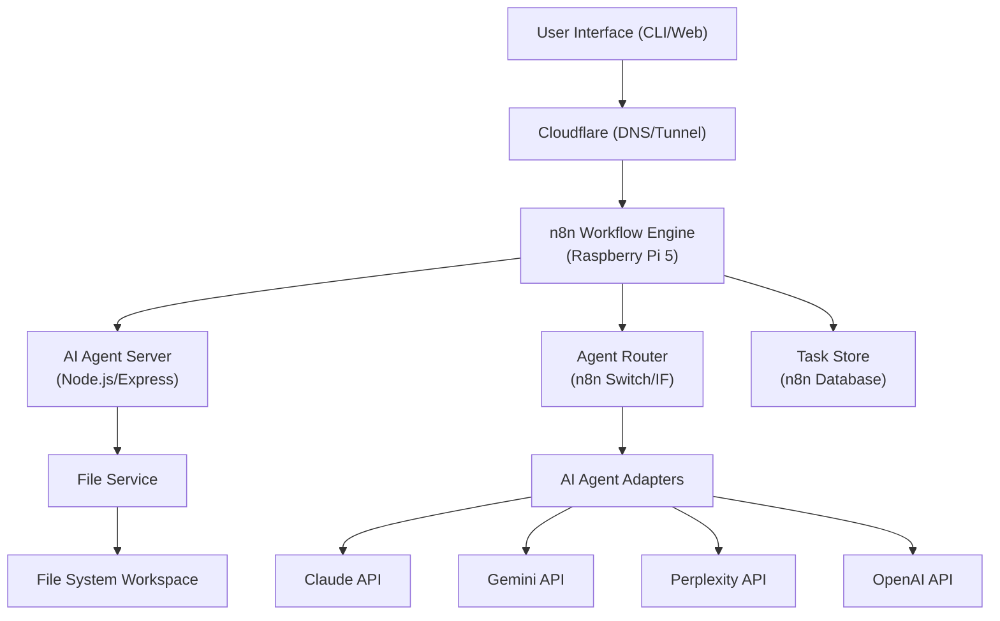
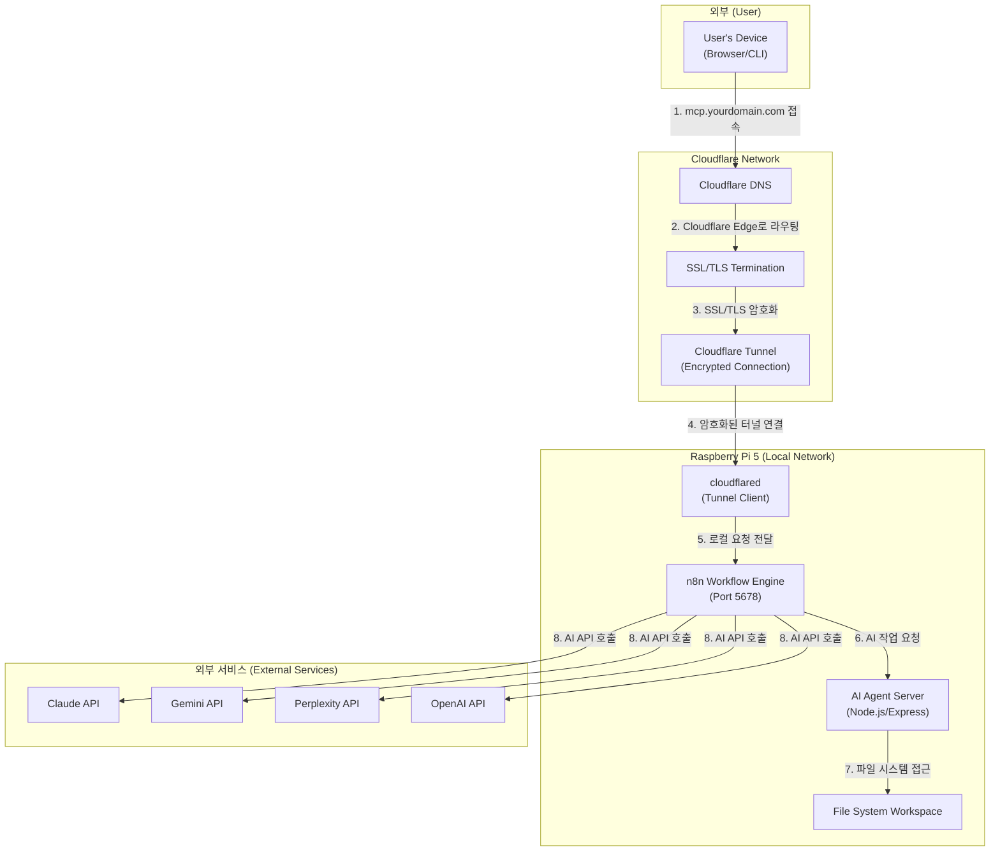

### **MCP-Agent-Server 시스템 아키텍처 (논리적)**

> **📝 2026-01-12 업데이트:** n8n을 중앙 오케스트레이터로 하는 아키텍처로 전면 재설계
> **주요 변경:** ~~Nginx + 포트 포워딩~~ → Cloudflare Tunnel, ~~독립 서버~~ → n8n + AI Agent Server

### **흐름 설명 (논리적)**

1.  **사용자 (User):** `CLI`, `웹 UI`, 또는 외부 시스템을 통해 개발 목표나 작업을 지시합니다.
2.  ⏳ **Cloudflare:** DNS 및 Tunnel을 통해 외부 요청을 Raspberry Pi 5로 안전하게 라우팅합니다. `[계획: 미구축]`
3.  ✅ **n8n Workflow Engine:** 모든 작업의 중앙 오케스트레이터로 작동합니다. `[완료: 2026-01-12 - 로컬 구축]`
    *   ⏳ 사용자 요청 수신 (Webhook) `[계획: 미구축]`
    *   ⏳ 작업 분해 및 라우팅 `[계획: 미구축]`
    *   ⏳ AI 에이전트 호출 및 결과 수집 `[계획: 미구축]`
    *   ⏳ 작업 상태 추적 및 저장 `[계획: 미구축]`
4.  ⏳ **Agent Router (n8n):** n8n의 Switch/IF 노드를 통해 작업 유형에 따라 최적의 AI 에이전트를 선택합니다. `[계획: 미구축]`
5.  ⏳ **AI Agent Server:** Node.js/Express 기반 서버로 각 AI 모델의 어댑터를 제공합니다. `[계획: 미구축]`
6.  ⏳ **AI Agent Adapters:** 각 AI 모델(Claude, Gemini, Perplexity, OpenAI)의 API와 통신합니다. `[계획: 미구축]`
7.  ⏳ **File Service:** 워크스페이스의 파일을 읽고, 쓰고, 수정하는 기능을 제공합니다. `[계획: 미구축]`
8.  ⏳ **Task Store:** n8n 내부 데이터베이스 또는 외부 DB를 통해 작업 상태를 영구 저장합니다. `[계획: 미구축]`

---

### **물리적 워크플로우 (Cloudflare + Raspberry Pi 5 아키텍처)** `[2026-01-12 전면 재설계]`

> **🔄 주요 변경:** ~~Nginx + 포트 포워딩 방식~~ → Cloudflare Tunnel 방식으로 전환

### **상세 흐름 설명 (Cloudflare Tunnel 기반 접속)**

1.  ⏳ **도메인 접속:** 외부 사용자가 `mcp.yourdomain.com`을 입력합니다. `[계획: 미구축]`
2.  ⏳ **Cloudflare DNS 조회:** Cloudflare DNS가 요청을 받아 Cloudflare의 Edge 네트워크로 라우팅합니다. `[계획: 미구축]`
3.  ⏳ **SSL/TLS 처리:** Cloudflare가 SSL/TLS 인증서를 통해 HTTPS 통신을 처리합니다. (Let's Encrypt 필요 없음) `[계획: 미구축]`
4.  ⏳ **Cloudflare Tunnel:** Cloudflare Edge에서 Raspberry Pi 5의 `cloudflared` 데몬으로 암호화된 터널을 통해 요청을 전달합니다. `[계획: 미구축]`
    *   **장점:** 포트 포워딩 불필요, 동적 IP 문제 해결, DDoS 보호
5.  ⏳ **Tunnel Client:** Raspberry Pi 5의 `cloudflared` 데몬이 요청을 받아 로컬 n8n(Port 5678)으로 전달합니다. `[계획: 미구축]`
6.  ✅ **n8n Workflow 실행:** n8n이 요청을 분석하고 적절한 워크플로우를 실행합니다. `[완료: 2026-01-12 - 로컬 구축, 워크플로우는 미구축]`
7.  ⏳ **AI Agent Server 호출:** 필요시 n8n이 로컬 AI Agent Server(Node.js/Express)를 HTTP로 호출합니다. `[계획: 미구축]`
8.  ⏳ **파일 시스템 작업:** Agent Server가 워크스페이스의 파일을 읽고 쓰는 작업을 수행합니다. `[계획: 미구축]`
9.  ⏳ **외부 AI API 호출:** n8n이 직접 또는 Agent Server를 통해 외부 AI API(Claude, Gemini 등)를 호출합니다. `[계획: 미구축]`