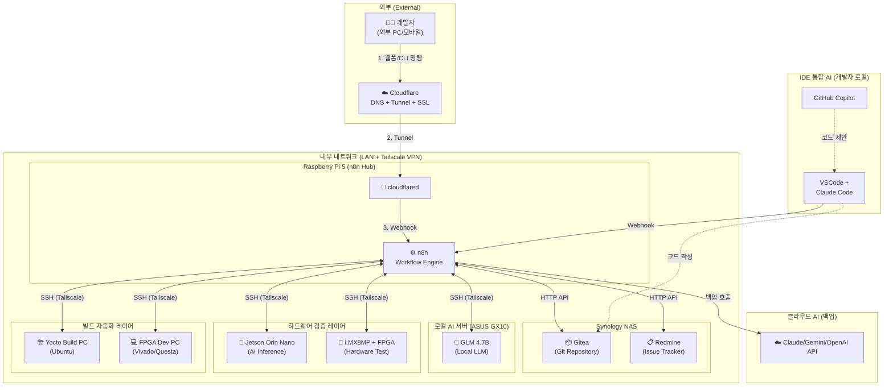
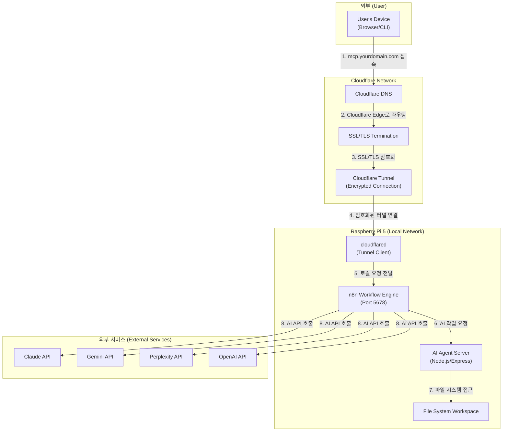

### **MCP-Agent-Server 시스템 아키텍처 (논리적)**

> **📝 2026-01-12 업데이트:** 하드웨어 개발 워크플로우 자동화 아키텍처로 전면 재설계 `[2026-01-12 업데이트]`
> **주요 변경:**
> - ~~클라우드 AI 중심~~ → 로컬 LLM + IDE AI + 하드웨어 검증 통합 `[2026-01-12 추가]`
> - ~~Nginx + 포트 포워딩~~ → Cloudflare Tunnel
> - ~~독립 서버~~ → n8n + AI Agent Server
> - **신규 추가:** Gitea + Redmine DevOps 통합, Tailscale VPN 네트워크 `[2026-01-12 추가]`

### **통합 개발 워크플로우 (Unified Development Workflow)** `[2026-01-12 추가]`

1.  **작업 시작 (Task Initiation)** `[2026-01-12 추가]`
    - 개발자가 외부 웹폼 또는 CLI를 통해 작업 지시 (예: "신규 기능 개발", "디버깅 요청")
    - Cloudflare를 통해 n8n Webhook 호출 ✅ `[완료: 2026-01-12 - Cloudflare Tunnel 구축]`

2.  **작업 등록 (Task Registration)** `[2026-01-12 추가]`
    - ⏳ n8n이 Redmine API를 호출하여 이슈 자동 생성 `[계획: 미구축]`
    - ⏳ Redmine 이슈 번호를 작업 ID로 사용 `[계획: 미구축]`

3.  **코드 작성 (Code Generation)** `[2026-01-12 추가]`
    - **Option A:** 개발자가 VSCode에서 Claude Code/Copilot으로 직접 작성 ✅ `[구독 활성: 2026-01-12]`
    - **Option B:** ⏳ n8n이 ASUS GX10의 GLM 4.7B를 SSH로 호출하여 자동 코드 생성 `[계획: 미구축]`

4.  **코드 검증 (Code Verification)** `[2026-01-12 추가]`
    - ⏳ Jetson Orin Nano: AI 모델 추론 성능 테스트 (SSH 원격 실행) `[계획: 미구축]`
    - ⏳ i.MX8MP + FPGA: 하드웨어 구현 검증 (SSH 원격 실행) `[계획: 미구축]`

5.  **빌드 자동화 (Build Automation)** `[2026-01-12 추가]`
    - ⏳ Yocto PC: n8n이 SSH로 Yocto 빌드 스크립트 실행 `[계획: 미구축]`
    - ⏳ FPGA Dev PC: n8n이 SSH로 Vivado 합성/Questa 시뮬레이션 실행 `[계획: 미구축]`

6.  **Git 통합 (Git Integration)** `[2026-01-12 추가]`
    - ⏳ n8n이 Gitea API를 통해 브랜치 생성, 커밋, Pull Request 자동 생성 `[계획: 미구축]`
    - ⏳ Redmine 이슈와 Gitea PR을 자동 연결 `[계획: 미구축]`
    - ✅ Gitea 접속 가능 `[완료: 기존 설치]`

7.  **피드백 루프 (Feedback Loop)** `[2026-01-12 추가]`
    - ⏳ 빌드 실패 시 n8n Error Trigger 발동 `[계획: 미구축]`
    - ⏳ GLM 4.7B가 에러 로그 분석 후 수정 제안 `[계획: 미구축]`
    - ⏳ 자동 재빌드 또는 개발자에게 알림 `[계획: 미구축]`

### **흐름 설명 (기존 논리적 구조)**

1.  **사용자 (User):** `CLI`, `웹 UI`, 또는 외부 시스템을 통해 개발 목표나 작업을 지시합니다.
2.  ✅ **Cloudflare:** DNS 및 Tunnel (abyz-n8n)을 통해 외부 요청을 Raspberry Pi 5로 안전하게 라우팅합니다. `[완료: 2026-01-12]`
3.  ✅ **n8n Workflow Engine:** 모든 작업의 중앙 오케스트레이터로 작동합니다. `[완료: 2026-01-12 - Docker 컨테이너 배포]`
    *   ⏳ 사용자 요청 수신 (Webhook) `[계획: 미구축]`
    *   ⏳ 작업 분해 및 라우팅 `[계획: 미구축]`
    *   ⏳ AI 에이전트 호출 및 결과 수집 `[계획: 미구축]`
    *   ⏳ 작업 상태 추적 및 저장 `[계획: 미구축]`
4.  ⏳ **Agent Router (n8n):** n8n의 Switch/IF 노드를 통해 작업 유형에 따라 최적의 AI 에이전트를 선택합니다. `[계획: 미구축]`
5.  ⏳ **로컬 LLM (GLM 4.7B):** ASUS GX10에서 실행되며, n8n이 SSH를 통해 반복 작업 자동화 요청을 전달합니다. `[계획: 미구축]` `[2026-01-12 추가]`
6.  ⏳ **클라우드 AI API:** 복잡한 작업에 대한 백업으로 Claude, Gemini, OpenAI API를 호출합니다. `[계획: 미구축]`
7.  ✅ **Gitea:** Synology NAS에서 실행되는 셀프 호스팅 Git 저장소입니다. `[완료: 기존 설치]` `[2026-01-12 추가]`
8.  ✅ **Redmine:** Synology NAS에서 실행되는 이슈 추적 시스템입니다. `[완료: 기존 설치]` `[2026-01-12 추가]`

---

### **물리적 워크플로우 (Cloudflare + Raspberry Pi 5 아키텍처)** `[2026-01-12 전면 재설계]`

> **🔄 주요 변경:** ~~Nginx + 포트 포워딩 방식~~ → Cloudflare Tunnel 방식으로 전환

### **상세 흐름 설명 (Cloudflare Tunnel 기반 접속)**

1.  ✅ **도메인 접속:** 외부 사용자가 `https://api.abyz-lab.work`를 입력합니다. `[완료: 2026-01-12]`
2.  ✅ **Cloudflare DNS 조회:** Cloudflare DNS가 요청을 받아 Cloudflare의 Edge 네트워크로 라우팅합니다. `[완료: 2026-01-12]`
3.  ✅ **SSL/TLS 처리:** Cloudflare가 SSL/TLS 인증서를 통해 HTTPS 통신을 처리합니다. (Let's Encrypt 필요 없음) `[완료: 2026-01-12]`
4.  ✅ **Cloudflare Tunnel:** Cloudflare Edge에서 Raspberry Pi 5의 `cloudflared` 데몬 (Tunnel: abyz-n8n)으로 암호화된 터널을 통해 요청을 전달합니다. `[완료: 2026-01-12]`
    *   **장점:** 포트 포워딩 불필요, 동적 IP 문제 해결, DDoS 보호
5.  ✅ **Tunnel Client:** Raspberry Pi 5의 `cloudflared` 데몬이 요청을 받아 로컬 n8n(Port 5678)으로 전달합니다. `[완료: 2026-01-12]`
6.  ✅ **n8n Workflow 실행:** n8n Docker 컨테이너가 요청을 분석하고 적절한 워크플로우를 실행합니다. `[완료: 2026-01-12 - 컨테이너 구축, 워크플로우는 미구축]`
7.  ⏳ **AI Agent Server 호출:** 필요시 n8n이 로컬 AI Agent Server(Node.js/Express)를 HTTP로 호출합니다. `[계획: 미구축]`
8.  ⏳ **파일 시스템 작업:** Agent Server가 워크스페이스의 파일을 읽고 쓰는 작업을 수행합니다. `[계획: 미구축]`
9.  ⏳ **외부 AI API 호출:** n8n이 직접 또는 Agent Server를 통해 외부 AI API(Claude, Gemini 등)를 호출합니다. `[계획: 미구축]`