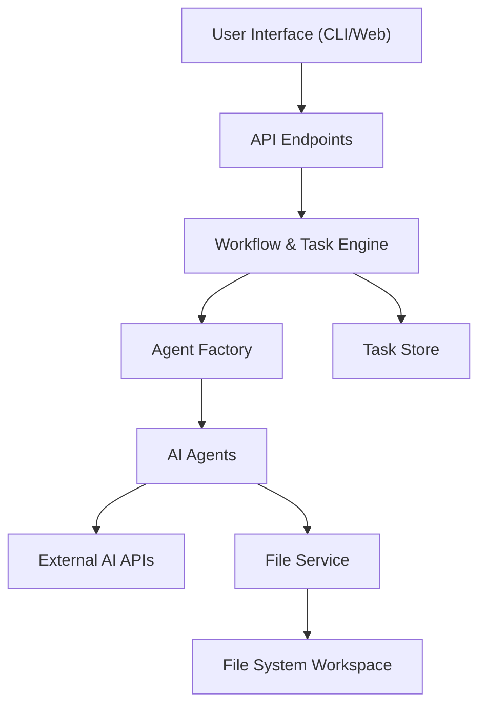
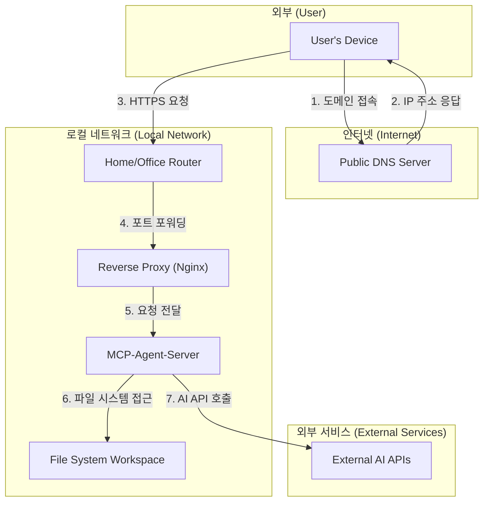

### **MCP-Agent-Server 시스템 아키텍처 (논리적)**

### **흐름 설명 (논리적)**

1.  **사용자 (User):** `CLI` 또는 `웹 UI`를 통해 개발 목표나 작업을 지시합니다.
2.  **API Endpoints:** 서버의 진입점으로, 사용자의 요청을 받아 내부 시스템에 전달합니다.
3.  **Workflow & Task Engine:** 작업의 생성, 분해, 상태 변경 등 전체적인 흐름을 제어하는 핵심 엔진입니다.
4.  **Agent Factory:** 작업에 필요한 AI 에이전트(Gemini, Claude 등)를 동적으로 생성하고 제공합니다.
5.  **AI Agent Adapters:** 각 AI 모델의 API와 통신하는 역할을 수행하며, `File Service`를 통해 작업 공간의 파일에 접근합니다.
6.  **External Dependencies:** 에이전트가 호출하는 외부 AI API들과, 실제 코드가 저장되는 파일 시스템(Workspace)을 의미합니다.

---

### **물리적 워크플로우 (상세 접속 및 배포 아키텍처)**

### **상세 흐름 설명 (외부 접속 시나리오)**

1.  **DNS 조회:** 외부 사용자가 웹 브라우저에 `mcp.your-domain.com`을 입력하면, 컴퓨터는 `공용 DNS 서버`에 해당 도메인의 IP 주소를 물어봅니다.
2.  **IP 주소 응답:** DNS 서버는 미리 등록된 `Public IP`(집이나 사무실의 공인 IP) 주소를 사용자에게 알려줍니다. (이때 DDNS 서비스가 중간에 사용될 수 있습니다.)
3.  **HTTPS 요청:** 사용자의 브라우저는 알아낸 `Public IP` 주소를 목적지로 하여 HTTPS 요청을 보냅니다. 이 요청은 집이나 사무실의 `라우터(공유기)`에 도달합니다.
4.  **포트 포워딩:** `라우터`는 443 포트로 들어온 요청을, 미리 설정된 규칙에 따라 내부 네트워크의 `서버 머신`(Nginx가 실행 중인 PC)으로 전달(포트 포워딩)합니다.
5.  **리버스 프록시 및 SSL 처리:** `Nginx`는 요청을 받아 SSL 인증서(`mcp.your-domain.com` 용)를 통해 HTTPS 통신을 처리합니다. 그 후 암호화가 해제된 일반 HTTP 요청을 내부적으로 실행 중인 `MCP-Agent-Server`(예: `http://localhost:3000`)으로 전달합니다.
6.  **애플리케이션 로직 수행:** `MCP-Agent-Server`는 요청을 처리하고, 로컬 `파일 시스템`의 코드를 읽고 쓰는 등의 작업을 수행합니다.
7.  **외부 API 호출:** 필요시, 서버는 다시 인터넷을 통해 `외부 AI API`를 호출하고 그 결과를 받아 로직을 이어갑니다.