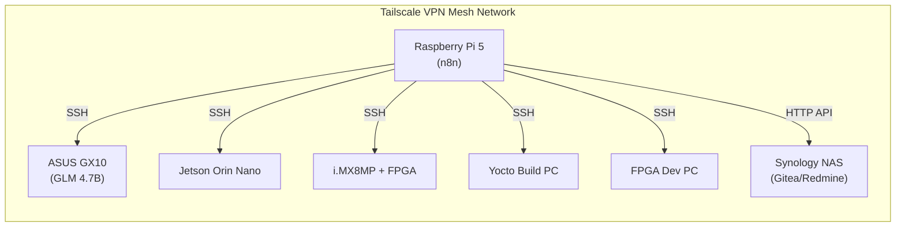
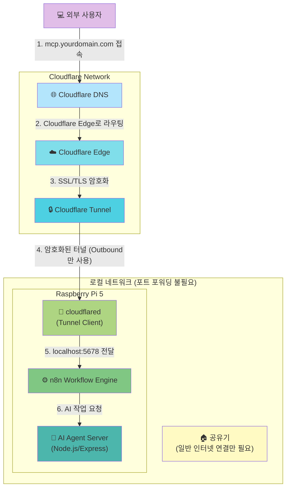
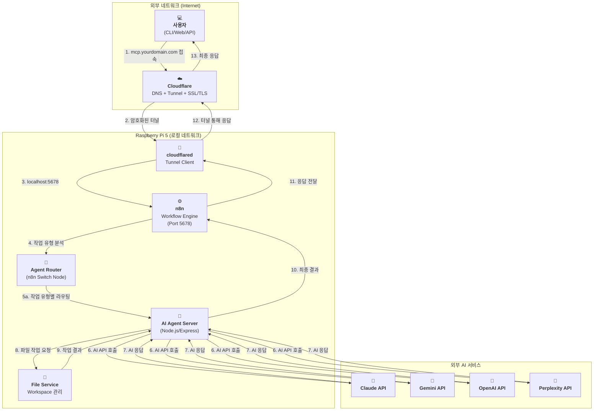

### **외부 접속 환경 구축 가이드 (Deployment Guide)**

> **📝 2026-01-12 업데이트:** Cloudflare Tunnel 기반 배포로 전환
>
> **제거된 요구사항:**
> - ~~포트 포워딩 (공유기 설정 불필요)~~
> - ~~DDNS (동적 IP 자동 해결)~~
> - ~~Let's Encrypt (Cloudflare SSL 자동 처리)~~
> - ~~Nginx (선택사항으로 변경)~~

## Cloudflare + Raspberry Pi 5 + n8n 기반 배포 아키텍처

외부에서 도메인으로 접속 가능한 셀프 호스팅 서버를 Cloudflare Tunnel을 활용하여 구축합니다.

| 구분 (Layer) | 필수 구성 요소 | 핵심 역할 (해야 할 일) | 추천 도구 / 서비스 | 구축 상태 | 변경일자 |
| :--- | :--- | :--- | :--- | :--- | :--- |
| **1. 하드웨어** | **Raspberry Pi 5** | n8n 및 AI Agent Server를 호스팅하는 물리적 서버 | Raspberry Pi 5 (8GB RAM) | ✅ 완료 | `[완료: 2026-01-12]` |
| **2. 주소 (Address)** | **도메인 (Domain)** | 고유한 인터넷 주소를 구매하고 소유합니다. | api.abyz-lab.work | ✅ 완료 | `[완료: 2026-01-12]` |
| **3. 연결 (Connection)** | **Cloudflare DNS** | 구매한 도메인을 Cloudflare DNS로 관리하며, Cloudflare 네트워크로 라우팅합니다. | Cloudflare (무료 플랜) | ✅ 완료 | `[완료: 2026-01-12]` |
| | **Cloudflare Tunnel** | 포트 포워딩 없이 암호화된 터널을 통해 외부 요청을 Raspberry Pi 5로 안전하게 전달합니다. | cloudflared (Tunnel: abyz-n8n) | ✅ 완료 | `[완료: 2026-01-12]` |
| | ~~**DDNS**~~ | **불필요** (Cloudflare Tunnel 사용 시 동적 IP 문제 자동 해결) | - | N/A | `[2026-01-12 제거]` |
| **4. 관문 (Gateway)** | ~~**포트 포워딩**~~ | **불필요** (Cloudflare Tunnel이 외부 접속 경로 제공) | - | N/A | `[2026-01-12 제거]` |
| **5. 워크플로우 엔진** | **n8n** | 모든 작업의 중앙 오케스트레이터로, AI 에이전트 호출 및 작업 관리를 담당합니다. | n8n Docker 컨테이너 (Port 5678) | ✅ 완료 | `[완료: 2026-01-12]` |
| **6. 서버 (Server)** | **AI Agent Server** | Node.js/Express 기반 서버로 각 AI 모델 어댑터를 제공합니다. | Node.js + Express + TypeScript | ⏳ 계획 | `[계획: 미구축]` |
| | ~~**리버스 프록시**~~ | **선택사항** (Cloudflare가 SSL/TLS 처리, n8n 직접 노출) | Nginx (선택사항) | ⏳ 계획 | `[계획: 선택사항]` |
| | **SSL/TLS 인증서** | Cloudflare가 자동으로 처리합니다. | Cloudflare (자동 SSL/TLS) | ✅ 완료 | `[완료: 2026-01-12]` |
| **7. 실행 (Runtime)** | **프로세스 매니저** | n8n 및 cloudflared가 안정적으로 24시간 동작하도록 관리합니다. | Docker (restart policy), systemd | ✅ 완료 | `[완료: 2026-01-12]` |
| **8. IDE 통합 AI** | **Claude Code** | 개발자 IDE에서 실시간 코드 작성 및 리팩토링 지원 | VSCode Extension + CLI | ✅ 구독 활성 | `[2026-01-12]` | `[2026-01-12 추가]`
| | **GitHub Copilot** | IDE 내장 코드 자동완성 및 제안 | VSCode/JetBrains 플러그인 | ✅ 구독 활성 | `[2026-01-12]` | `[2026-01-12 추가]`
| **9. 로컬 LLM** | **ASUS GX10 + GLM 4.7B** | n8n이 SSH를 통해 호출하는 반복 작업 자동화 (로그 분석, 코드 생성) | ASUS GX10 (SSH 접속) | ⏳ 계획 | `[2026-01-12]` | `[2026-01-12 추가]`
| **10. 하드웨어 검증** | **Jetson Orin Nano** | n8n이 SSH를 통해 AI 모델 추론 성능 검증 | Jetson Orin Nano (SSH) | ⏳ 계획 | `[2026-01-12]` | `[2026-01-12 추가]`
| | **i.MX8MP + FPGA** | n8n이 SSH를 통해 하드웨어 구현 검증 및 테스트 | Veriscite EVKIT (SSH) | ⏳ 계획 | `[2026-01-12]` | `[2026-01-12 추가]`
| **11. 빌드 자동화** | **Yocto Build PC** | n8n이 SSH로 Yocto 이미지 자동 빌드 | Ubuntu PC (SSH) | ⏳ 계획 | `[2026-01-12]` | `[2026-01-12 추가]`
| | **FPGA Dev PC** | n8n이 SSH로 FPGA 합성 및 시뮬레이션 자동화 | Vivado, Questa (SSH) | ⏳ 계획 | `[2026-01-12]` | `[2026-01-12 추가]`
| **12. DevOps** | **Gitea** | 셀프 호스팅 Git 저장소 (n8n이 API로 통합) | Synology NAS (HTTP API) | ✅ 구축 완료 | `[기존 설치]` | `[2026-01-12 추가]`
| | **Redmine** | 이슈 추적 및 작업 관리 (n8n이 API로 통합) | Synology NAS (HTTP API) | ✅ 구축 완료 | `[기존 설치]` | `[2026-01-12 추가]`
| **13. 네트워크** | **LAN + Tailscale VPN** | 모든 장비가 SSH 및 HTTP로 통신 가능 | 내부 네트워크 + Tailscale | ✅ 구축 완료 | `[기존 설치]` | `[2026-01-12 추가]`

## 네트워크 연결 흐름도 (Tailscale VPN 방식) `[2026-01-12 추가]`

아래 다이어그램은 Tailscale VPN을 통해 n8n이 모든 장비와 SSH로 연결되는 경로를 보여줍니다.



---

## 물리적 연결 흐름도 (Cloudflare Tunnel 방식)

아래 다이어그램은 Cloudflare Tunnel을 통해 외부 사용자가 Raspberry Pi 5의 n8n까지 연결되는 경로를 보여줍니다.



## 아키텍처 흐름도 (n8n 기반 워크플로우)

아래 다이어그램은 사용자가 외부에서 접속하여 n8n을 통해 AI 응답을 받기까지의 전체 과정을 보여줍니다.



---

## 4. 네트워크 토폴로지 (Tailscale VPN) `[2026-01-13 통합]`

> **📝 출처:** NETWORK_TOPOLOGY.md 통합 `[2026-01-13 통합]`

### 4.1 Tailscale VPN 구성

**개요:**
- 모든 장비가 동일한 Tailscale 네트워크에 연결
- SSH 접속 가능 (포트 22)
- 포트 포워딩 불필요 (Mesh VPN 구조)
- n8n이 모든 장비에 SSH Execute Command 노드로 원격 명령 실행

**장점:**
- **Zero Configuration:** 별도의 포트 포워딩 설정 불필요
- **보안:** 모든 통신이 WireGuard 프로토콜로 암호화
- **네트워크 독립:** 각 장비가 서로 다른 네트워크에 있어도 연결 가능
- **n8n 통합:** n8n SSH 노드에서 Tailscale IP로 직접 접속

---

### 4.2 장비별 연결 정보

> **⚠️ 주의:** 아래 IP 주소는 예시입니다. 실제 Tailscale IP로 교체하세요.

| 장비 | Tailscale IP | SSH 접속 명령 | 역할 | 구축 상태 |
|:---|:---|:---|:---|:---|
| Raspberry Pi 5 | `100.x.x.1` | `ssh pi@100.x.x.1` | n8n Hub (중앙 오케스트레이터) | ✅ 완료 |
| ASUS GX10 | `100.x.x.2` | `ssh user@100.x.x.2` | GLM 4.7B LLM (로컬 AI 추론) | ⏳ 계획 |
| Jetson Orin Nano | `100.x.x.3` | `ssh nvidia@100.x.x.3` | AI Inference (추론 성능 테스트) | ⏳ 계획 |
| i.MX8MP + FPGA | `100.x.x.4` | `ssh root@100.x.x.4` | Hardware Test (하드웨어 검증) | ⏳ 계획 |
| Yocto Build PC | `100.x.x.5` | `ssh user@100.x.x.5` | Yocto Build (이미지 자동 빌드) | ⏳ 계획 |
| FPGA Dev PC | `100.x.x.6` | `ssh user@100.x.x.6` | Vivado/Questa (합성/시뮬레이션) | ⏳ 계획 |
| Synology NAS | `100.x.x.7` | HTTP API | Gitea/Redmine (DevOps) | ✅ 완료 |

---

### 4.3 n8n SSH 연결 설정

#### Step 1: Raspberry Pi 5에서 SSH 키 생성

```bash
ssh-keygen -t ed25519 -C "n8n@raspberry-pi"
# 기본 경로에 저장: ~/.ssh/id_ed25519
```

#### Step 2: 각 장비에 공개 키 복사

```bash
ssh-copy-id -i ~/.ssh/id_ed25519.pub user@100.x.x.2  # ASUS GX10
ssh-copy-id -i ~/.ssh/id_ed25519.pub nvidia@100.x.x.3  # Jetson
ssh-copy-id -i ~/.ssh/id_ed25519.pub root@100.x.x.4    # i.MX8MP
ssh-copy-id -i ~/.ssh/id_ed25519.pub user@100.x.x.5    # Yocto PC
ssh-copy-id -i ~/.ssh/id_ed25519.pub user@100.x.x.6    # FPGA PC
```

#### Step 3: n8n SSH 노드 설정

1. n8n에서 **Credentials** → **New Credential** → **SSH**
2. **Authentication**: `Private Key`
3. **Private Key**: Raspberry Pi 5의 `~/.ssh/id_ed25519` 내용 복사
4. 각 장비별로 Credential 생성 (호스트 IP, 사용자명 다름)

---

### 4.4 n8n Execute Command 노드 사용 예시

#### 예시 1: ASUS GX10에서 GLM 4.7B 추론 실행

```json
{
  "authentication": "privateKey",
  "credentials": "ASUS GX10 SSH",
  "host": "100.x.x.2",
  "user": "user",
  "command": "python /opt/glm/inference.py --prompt '{{ $json.prompt }}'"
}
```

#### 예시 2: Jetson Orin Nano에서 AI 모델 테스트

```json
{
  "authentication": "privateKey",
  "credentials": "Jetson SSH",
  "host": "100.x.x.3",
  "user": "nvidia",
  "command": "python /home/nvidia/test_model.py --model {{ $json.model_path }}"
}
```

#### 예시 3: Yocto Build PC에서 이미지 빌드

```json
{
  "authentication": "privateKey",
  "credentials": "Yocto PC SSH",
  "host": "100.x.x.5",
  "user": "user",
  "command": "cd /opt/yocto && bitbake core-image-minimal"
}
```

---

### 4.5 Tailscale 설치 및 초기 설정

#### 모든 장비에 Tailscale 설치

**Ubuntu/Debian 계열 및 Raspberry Pi OS:**
```bash
curl -fsSL https://tailscale.com/install.sh | sh
sudo tailscale up
```

**Jetson (Ubuntu 기반):**
```bash
curl -fsSL https://tailscale.com/install.sh | sh
sudo tailscale up
```

#### Tailscale 네트워크 확인

```bash
tailscale status
```

**출력 예시:**
```
100.x.x.1   raspberry-pi-5     pi@           linux   active; relay
100.x.x.2   asus-gx10          user@         linux   active; direct
100.x.x.3   jetson-orin        nvidia@       linux   active; direct
...
```

---

### 4.6 네트워크 보안 권장사항

**1. SSH 키 관리:**
- 비밀 키(`id_ed25519`)는 Raspberry Pi 5에만 보관
- 정기적으로 키 로테이션 (6개월마다)

**2. Tailscale ACL (Access Control List):**
- Tailscale 대시보드에서 ACL 설정
- Raspberry Pi 5만 다른 장비에 접속 허용

**3. 방화벽 설정:**
- 각 장비에서 Tailscale 인터페이스만 SSH 허용
```bash
sudo ufw allow in on tailscale0 to any port 22
sudo ufw enable
```

---

### 4.7 네트워크 트러블슈팅

#### 문제 1: SSH 연결 실패
**원인:** SSH 키 인증 미설정
**해결:**
```bash
ssh-copy-id -i ~/.ssh/id_ed25519.pub user@100.x.x.2
```

#### 문제 2: Tailscale IP 연결 불가
**원인:** Tailscale 데몬 미실행
**해결:**
```bash
sudo systemctl start tailscaled
sudo tailscale up
```

#### 문제 3: n8n Execute Command 노드에서 Permission Denied
**원인:** SSH 키 권한 문제
**해결:**
```bash
chmod 600 ~/.ssh/id_ed25519
chmod 644 ~/.ssh/id_ed25519.pub
```

---

## 5. Cloudflare Tunnel 구축 상세 가이드 `[2026-01-13 통합]`

> **📝 출처:** n8n_cloudflare_tunnel_setup.md 통합 `[2026-01-13 통합]`
> **작성일:** 2026-01-12

### 5.1 사전 준비사항

- Raspberry Pi OS 최신 업데이트
- Docker & Docker Compose 설치
- Cloudflare 계정 및 도메인 준비 (api.abyz-lab.work)
- cloudflared 설치

---

### 5.2 n8n Docker 배포

#### docker-compose.yml 설정

```yaml
version: "3.8"

services:
  n8n:
    image: n8nio/n8n:latest
    container_name: n8n
    restart: unless-stopped
    ports:
      - "5678:5678"
    environment:
      - WEBHOOK_URL=https://api.abyz-lab.work
      - TZ=Asia/Seoul
      - N8N_SECURE_COOKIE=false
      - N8N_BASIC_AUTH_ACTIVE=true
      - N8N_BASIC_AUTH_USER=admin
      - N8N_BASIC_AUTH_PASSWORD=abyz@0809
      - N8N_HOST=0.0.0.0
      - N8N_PORT=5678
      - N8N_PROTOCOL=http
      - N8N_ENCRYPTION_KEY=~!duck5625
    volumes:
      - ./n8n_data:/home/node/.n8n
```

#### 컨테이너 실행

```bash
docker compose up -d
docker ps | grep n8n
```

---

### 5.3 Cloudflare Tunnel 설정

#### Step 1: 터널 생성

```bash
cloudflared tunnel create abyz-n8n
```

#### Step 2: config.yml 생성 (~/.cloudflared/config.yml)

```yaml
tunnel: abyz-n8n
credentials-file: /home/raspi/.cloudflared/7be6cf9a-dc35-4add-815c-da4810d9e0c5.json

ingress:
  - hostname: api.abyz-lab.work
    service: http://localhost:5678
  - service: http_status:404
```

#### Step 3: DNS CNAME 설정 (Cloudflare 대시보드)

- **호스트:** api
- **값:** 7be6cf9a-dc35-4add-815c-da4810d9e0c5.cfargotunnel.com
- **프록시:** 활성화 (주황 구름)

#### Step 4: cloudflared 서비스 등록 및 자동 시작

```bash
sudo cloudflared service install
sudo systemctl enable cloudflared
sudo systemctl start cloudflared
sudo systemctl status cloudflared
```

---

### 5.4 시스템 튜닝 (QUIC/UDP 버퍼 문제 해결)

#### /etc/sysctl.conf 수정

```bash
net.core.rmem_max=8388608
net.core.wmem_max=8388608
```

#### 적용

```bash
sudo sysctl -p
sudo systemctl restart cloudflared
```

**UDP 버퍼 에러 예시:**
```
failed to sufficiently increase receive buffer size (was: 208 kiB, wanted: 7168 kiB, got: 416 kiB)
```
→ sysctl.conf 수정으로 해결됨

---

### 5.5 최종 확인 및 검증

#### 1. n8n 컨테이너 상태 확인

```bash
docker ps | grep n8n
```

#### 2. Cloudflare Tunnel 상태 확인

```bash
sudo systemctl status cloudflared
cloudflared tunnel list
cloudflared tunnel info abyz-n8n
```

#### 3. 브라우저 접속 테스트

```
https://api.abyz-lab.work
```

---

### 5.6 자동 실행 보장

- **Docker 컨테이너:** `restart: unless-stopped` 설정으로 자동 재시작
- **Cloudflared 서비스:** `systemctl enable cloudflared`로 부팅 시 자동 실행
- **재부팅 후에도 자동 실행 확인 완료**

---

### 5.7 로그 및 디버깅

#### n8n 로그

```bash
docker-compose logs -f n8n
```

#### cloudflared 로그

```bash
journalctl -u cloudflared -f
```

---

## 6. forms-interface 자동 배포 시스템 `[2026-01-27 추가]`

> **📝 목적:** forms-interface 웹 애플리케이션의 배포를 완전 자동화하여 Git 충돌 없이 안전하게 배포

### 6.1 개요

**특징:**
- **Git 충돌 자동 해결:** 로컬 변경 사항 자동 stash + reset 방식
- **읽기 전용 보호:** 핵심 파일 자동으로 읽기 전용 설정 (실수 수정 방지)
- **완전 자동화:** git pull → 배포 → 서비스 재시작 → 권한 설정까지 원큐에 해결
- **크로스 플랫폼:** Windows(개발) + Raspberry Pi(배포) 환경 지원

### 6.2 배포 워크플로우

```mermaid
graph LR
    Windows[Windows PC<br/>개발 환경] -->|1. 코드 수정| LocalGit[로컬 Git]
    LocalGit -->|2. windows-deploy.bat<br/>캐시 버전 자동 증가| GitHub[GitHub]
    GitHub -->|3. git push| Remote[원격 저장소]

    Remote -->|4. deploy-and-restart.sh| Pi[Raspberry Pi<br/>배포 서버]
    Pi -->|5. 자동 충돌 해결| Pull[Git Pull<br/>(Stash + Reset)]
    Pull -->|6. 심볼릭 링크| Deploy[/var/www/html/forms]
    Deploy -->|7. 서비스 재시작| Nginx[Nginx/Apache]

    style Windows fill:#e1bee7
    style Pi fill:#aed581
    style GitHub fill:#b3e5fc
    style Nginx fill:#81c784
```

### 6.3 Windows (개발 환경)

#### Step 1: 코드 수정

Windows에서 `forms-interface/` 폴더의 파일들을 수정합니다:
- `index.html` - HTML 구조
- `script.js` - JavaScript 로직
- `styles.css` - 스타일시트

#### Step 2: 배포 스크립트 실행

```batch
# Windows에서 실행
windows-deploy.bat
```

**자동으로 수행하는 작업:**
1. Git 상태 확인 (변경 사항 체크)
2. 현재 캐시 버전 읽기 (예: 1.0.5)
3. 캐시 버전 자동 증가 (예: 1.0.5 → 1.0.6)
4. `index.html`의 버전 업데이트
5. Git 커밋 생성
6. GitHub에 푸시

**출력 예시:**
```
===================================
Forms Interface Deployment (Windows)
===================================

Step 1: Checking git status...
[OK] Working directory is clean

Step 2: Reading current cache version...
Current version: 1.0.5

Step 3: Incrementing cache version...
New version: 1.0.6

Step 4: Updating forms-interface\index.html...
[OK] Cache version updated to 1.0.6

Step 5: Committing and pushing changes...
[OK] Changes committed
Pushing to GitHub...
[OK] Changes pushed to GitHub

===================================
Deployment completed successfully!
===================================
```

### 6.4 Raspberry Pi (배포 환경)

#### 초기 설정 (최초 1회만 실행)

```bash
# Raspberry Pi에서 프로젝트 클론 후
cd ~/workspace/mcp-agent-server

# 초기 설정 스크립트 실행
chmod +x setup-raspberry-pi.sh
./setup-raspberry-pi.sh
```

**초기 설정이 자동으로 수행하는 작업:**
1. 웹 서버 설치 (nginx 또는 apache2)
2. 파일 권한 설정
3. 배포 스크립트 실행 권한 부여
4. (선택사항) 자동 업데이트 systemd 서비스 등록

#### 정기 배포 (Windows에서 푸시 후 실행)

**Step 1: 배포 전 검증 (권장)**

```bash
cd ~/workspace/mcp-agent-server

# 배포 전 환경 검증
./scripts/pre-deploy-check.sh
```

**검증 항목:**
- ✅ Git 워킹 디렉토리 상태 (uncommitted changes 체크)
- ✅ 파일 소유권 (raspi:raspi 확인)
- ✅ 네트워크 연결 (GitHub 접근 가능)
- ✅ 디스크 공간 (충분한 공간 확인)
- ✅ 웹 서버 상태 (nginx/apache 실행 중)

**Step 2: 배포 실행**

```bash
cd ~/workspace/mcp-agent-server
sudo ./deploy-forms.sh
```

**자동으로 수행하는 작업:**

1. **Git Pull:**
   ```bash
   git pull origin main
   ```

2. **배포:**
   - 기존 배포 백업 (`forms.backup.YYYYMMDD_HHMMSS`)
   - 심볼릭 링크 생성 (`/var/www/html/forms` → `forms-interface`)

3. **권한 설정 (Git 호환성 유지):**
   ```bash
   # 중요: chown 사용하지 않음 (사용자 소유권 유지)
   # 디렉토리: 755 (rwxr-xr-x)
   sudo find "$FORMS_DIR" -type d -exec chmod 755 {} \;
   # 파일: 644 (rw-r--r--)
   sudo find "$FORMS_DIR" -type f -exec chmod 644 {} \;
   ```

4. **자동 검증:**
   - ✅ 심볼릭 링크 존재 확인
   - ✅ 파일 권한 확인 (644)
   - ✅ HTTP 접속 테스트 (200 OK)

**출력 예시:**
```
===================================
Forms Interface Deployment Script
===================================

Step 1: Pulling latest changes from git...
✓ Git pull completed

Step 2: Detecting web server...
✓ Detected: nginx

Step 3: Deploying to /var/www/html...
Backing up existing forms directory...
Creating symbolic link...
Setting permissions...
✓ Deployment completed

Forms interface is now available at:
  → http://localhost/forms
  → https://forms.abyz-lab.work (via Cloudflare Tunnel)

Step 4: Verifying deployment...
✓ Symbolic link exists
✓ File permissions correct (644)
✓ HTTP access working (200)
✓ Deployment verification completed

===================================
Deployment completed successfully!
===================================

Test the form at: https://forms.abyz-lab.work
```

#### 배포 문제 해결

**문제: Git pull 실패 ("Permission denied")**

```bash
# 원인: 파일 소유권이 www-data로 변경되어 Git이 파일을 수정할 수 없음
# 해결: 소유권 복원
sudo chown -R raspi:raspi forms-interface/
git pull origin main
```

**문제: pre-deploy-check.sh 실행 권한 없음**

```bash
chmod +x ./scripts/pre-deploy-check.sh
```

**문제: HTTP 403 Forbidden**

```bash
# 파일 권한 확인
ls -la forms-interface/
# 예상: -rw-r--r-- 1 raspi raspi (644 권한)

# 권한 수정
sudo find forms-interface -type f -exec chmod 644 {} \;
sudo find forms-interface -type d -exec chmod 755 {} \;
```

#### 주의사항

**❌ 하지 말아야 할 것:**
- 배포 스크립트 내에서 `chown www-data:www-data` 사용
- 파일 소유권을 root나 www-data로 변경
- 750/640 권한 사용 (너무 제한적)

**✅ 해야 할 것:**
- 배포 전 `pre-deploy-check.sh` 실행
- 파일 소유권을 사용자(raspi:raspi)로 유지
- 755/644 권한 사용 (nginx 읽기 가능)
- 배포 후 HTTP 접속 테스트

**출력 예시:**
```
===================================
Forms Interface Auto-Deployment
===================================

Step 1: Pulling latest changes...
⚠ Local changes detected. Stashing for safe pull...
✓ Local changes stashed as: auto-stash-before-pull-20260127_143022
Note: Raspberry Pi should be read-only. Use 'git stash list' to review stashes.
Fetching from origin...
Resetting to origin/main...
✓ Git pull completed (no conflicts)

Step 2: Reading cache version...
✓ Current cache version: 1.0.6
Note: Version is managed on Windows, not modified here

Step 3: Detecting web server...
✓ Detected: nginx

Step 4: Deploying to /var/www/html/forms...
Backing up existing deployment...
Creating symbolic link...
Setting permissions...
Setting core files to read-only (prevents accidental edits)...
✓ Core files set to read-only
✓ Deployment completed

Step 5: Restarting web server...
✓ nginx restarted

Step 6: Verifying deployment...
✓ Symbolic link exists
✓ script.js found
✓ Email field present in script.js
✓ Cache version 1.0.6 verified in index.html

Step 7: Deployment complete!

===================================
Deployment completed successfully!
===================================

Access URLs:
  → http://localhost/forms
  → https://forms.abyz-lab.work

Workflow Reminder:
  • Raspberry Pi is deployment-only (read-only)
  • Make changes on Windows, then push to GitHub
  • Run this script to deploy automatically
  • To edit files on Pi temporarily: chmod 644 <file>
```

### 6.5 Git 충돌 해결 상세

**문제 원인:**
- Windows에서 수정 → git push
- Raspberry Pi에서도 수정 → git pull 시 충돌

**해결 방법 (자동):**
```bash
# deploy-and-restart.sh 내부 로직
if ! git diff --quiet || ! git diff --cached --quiet; then
    # 로컬 변경 감지
    git stash push -u -m "auto-stash-before-pull-$(date +%Y%m%d_%H%M%S)"
fi

git fetch origin main
git reset --hard origin/main  # 병합 없이 강제 reset
```

**장점:**
- 병합 충돌이 발생하지 않음
- 로컬 변경이 안전하게 보관됨 (stash)
- 원격 저장소 상태로 즉시 동기화

### 6.6 읽기 전용 파일 보호

**목적:** 라즈베리 파이에서 실수로 파일 수정 방지

**구현:**
```bash
# 배포 후 자동으로 핵심 파일을 읽기 전용으로 설정
chmod 444 "$FORMS_DIR/index.html"
chmod 444 "$FORMS_DIR/script.js"
chmod 444 "$FORMS_DIR/styles.css"
```

**임시로 수정이 필요한 경우:**
```bash
# 읽기 전용 해제
chmod 644 forms-interface/script.js

# 수정 후 다시 읽기 전용으로
chmod 444 forms-interface/script.js
```

### 6.7 파일 구조

```
mcp-agent-server/
├── forms-interface/           # 웹 애플리케이션
│   ├── index.html
│   ├── script.js
│   └── styles.css
├── deploy-and-restart.sh      # Raspberry Pi 배포 스크립트
├── windows-deploy.bat         # Windows 배포 스크립트
└── setup-raspberry-pi.sh      # Raspberry Pi 초기 설정 스크립트
```

### 6.8 배포 확인

#### 브라우저 접속
```
http://localhost/forms
https://forms.abyz-lab.work
```

#### 캐시 강력 새로고침
- Windows/Linux: `Ctrl + Shift + R`
- Mac: `Cmd + Shift + R`
- 또는 시크릿 모드/Incognito 사용

#### 배포 버전 확인
```bash
# Raspberry Pi에서
grep -oP 'script\.js\?v=\K[0-9.]+(?=["<])' /var/www/html/forms/index.html
# 출력: 1.0.6
```

### 6.9 트러블슈팅

#### 문제 1: Permission denied (checkout 실패)
**원인:** 웹 서버가 파일을 사용 중
**해결:**
```bash
# 웹 서버 중지
sudo systemctl stop nginx

# 권한 변경
sudo chown -R raspi:raspi forms-interface/

# 다시 배포
sudo ./deploy-and-restart.sh
```

#### 문제 2: 변경 사항이 반영되지 않음
**원인:** 브라우저 캐시
**해결:**
- `Ctrl + Shift + R`로 강력 새로고침
- 또는 캐시 버전이 올바르게 증가했는지 확인

#### 문제 3: 심볼릭 링크 오류
**확인:**
```bash
ls -la /var/www/html/ | grep forms
# 출력: lrwxrwxrwx 1 root root   XX Jan 27 14:30 forms -> /home/raspi/workspace/mcp-agent-server/forms-interface
```

### 6.10 자동화 옵션

#### systemd 타이머로 자동 업데이트 (선택사항)

초기 설정 스크립트 실행 시 자동 업데이트를 활성화할 수 있습니다:

```bash
./setup-raspberry-pi.sh
# "Do you want to enable auto-pull on boot? (y/n)" → y 선택
```

**동작:**
- 부팅 후 5분 후 첫 업데이트
- 이후 매 1시간마다 자동 업데이트
- systemd 서비스로 관리

**상태 확인:**
```bash
sudo systemctl status mcp-agent-server-update.timer
```

---

## 6.11 문제 해결 기록 `[2026-01-28 추가]`

> **목적:** 발생했던 문제들과 해결 방법을 문서화하여 동일한 실수 방지

### 6.11.1 파일명 불일치 (style.css vs styles.css)

**발생 일시:** 2026-01-28 배포 시도

**증상:**
```
chmod: cannot access '.../forms-interface/style.css': No such file or directory
[ERROR] Deployment failed. Rolling back...
```

**원인:**
- 실제 파일명: `styles.css` (복수)
- 코드 참조: `style.css` (단수)
- Windows 개발 환경에서만 검증하고 실제 라즈베리 파이 환경에서 파일 확인을 하지 않음

**해결:**
```bash
# 1. 실제 파일명 확인
ls -la forms-interface/*.css

# 2. 코드베이스 전체 검색
grep -r "style\.css" --include="*.html" --include="*.js" --include="*.sh" --include="*.md"

# 3. 모든 참조를 styles.css로 수정
# 수정 파일:
# - deploy-and-restart.sh
# - tests/deployment/**/*.sh
# - DEPLOYMENT_GUIDE.md
# - 기타 문서들
```

**예방:**
- [ ] 실제 파일명 확인 후 코드 작성
- [ ] grep으로 코드베이스 전체 검색 후 수정
- [ ] 두 환경에서 모두 파일 존재 확인

### 6.11.2 실행 권한 소실 (git pull 후)

**발생 일시:** 2026-01-28 최초 배포 시도

**증상:**
```
sudo-rs: cannot execute '.../deploy-and-restart.sh': Permission denied (os error 13)
```

**원인:**
- git pull 후 실행 권한이 유지되지 않음 (Windows → Linux line ending 문제 가능성)
- 저장소에서 클론 시 실행 권한이 설정되지 않음
- 파일 시스템 간 권한 전파 불일치

**해결:**
```bash
# 권한 재부여
chmod +x deploy-and-restart.sh
chmod +x setup-raspberry-pi.sh

# 권한 확인
ls -la *.sh
# expected: -rwxr-xr-x (755)
```

**예방:**
- [ ] setup-raspberry-pi.sh 실행 시 권한 자동 설정 (이미 구현됨)
- [ ] git pull 후 항상 권한 확인
- [ ] .gitattributes에 실행 권한 보존 설정 (선택사항)

### 6.11.3 sudo-rs 실행 거부

**발생 일시:** 2026-01-28 두 번째 배포 시도

**증상:**
```
thread 'main' panicked at src/exec/use_pty/monitor.rs:283:45
internal error: entered unreachable code
```

**원인:**
- sudo-rs (Rust로 재작성된 sudo 대체제)가 특정 상황에서 실행 거부
- 파일 권한이나 환경 변수 문제로 패닉 발생

**해결:**
```bash
# 방법 1: 권한 재부여 후 재시도
chmod +x deploy-and-restart.sh
sudo ./deploy-and-restart.sh

# 방법 2: sudo -s 사용 (shell 직접 실행)
sudo -s bash -c './deploy-and-restart.sh'

# 방법 3: 전통 sudo 사용 (설치되어 있는 경우)
sudo ./deploy-and-restart.sh
```

**예방:**
- [ ] chmod +x로 실행 권한 항상 부여
- [ ] sudo -s bash를 사용하여 shell 실행
- [ ] sudo-rs 문제가 지속되면 전통 sudo로 변경 검토

### 6.11.4 브라우저 캐시로 변경사항 반영 안 됨

**증상:** 배포 후 변경사항이 보이지 않음

**원인:** 브라우저가 이전 버전의 파일을 캐싱하고 있음

**해결:**
1. 캐시 강력 새로고침: `Ctrl + Shift + R` (Windows/Linux), `Cmd + Shift + R` (Mac)
2. 시크릿 모드/Incognito 모드 사용
3. 캐시 버전이 올바르게 증가했는지 확인:
   ```bash
   grep -oP 'script\.js\?v=\K[0-9.]+' /var/www/html/forms/index.html
   ```

**예방:**
- [ ] 항상 캐시 버전 증가 (windows-deploy.bat 자동화)
- [ ] 배포 후 즉시 브라우저 새로고침 안내

### 6.11.5 문제 해결 워크플로우

```
┌─────────────────────────────────────────────────────────┐
│ 1. 문제 발생                                         │
│    ↓                                                  │
│ 2. 문제 증상 로깅 (에러 메시지, 로그)               │
│    ↓                                                  │
│ 3. 원인 분석 (어떤 환경에서 발생?)                  │
│    ↓                                                  │
│ 4. 임시 조치 (롤백, 서비스 중지 등)                   │
│    ↓                                                  │
│ 5. 근본적 해결 (chmod 권한 부여, 파일명 수정 등)      │
│    ↓                                                  │
│ 6. 영구적 해결 (문서 업데이트, 프로세스 개선)        │
│    ↓                                                  │
│ 7. 재발 방지 (Pre-flight 체크리스트 추가)            │
└─────────────────────────────────────────────────────────┘
```

### 6.11.6 배포 실패 시 대응 절차

**1. 당황 대응:**
```bash
# 배포 실패 시 롤백 확인
ls -la /var/www/html/forms.backup.*

# 최신 백업으로 복원
sudo mv /var/www/html/forms.backup.YYYYMMDD_HHMMSS /var/www/html/forms

# 웹 서버 재시작
sudo systemctl restart nginx
```

**2. 로그 분석:**
```bash
# 배포 로그 확인
tail -50 $HOME/mcp-agent-deploy.log

# nginx 에러 로그
sudo tail -50 /var/log/nginx/error.log
```

**3. 문제 해결 후 재시도:**
```bash
# Pre-flight 체크리스트 실행
./pre-flight-check.sh

# 문제 해결 후 재배포
sudo ./deploy-and-restart.sh
```

**4. 이슈 트래킹:**
- 발생한 문제를 [docs/PRE_DEPLOYMENT_CHECKLIST.md](docs/PRE_DEPLOYMENT_CHECKLIST.md)에 기록
- 재발 방지를 위해 문서 업데이트
- 팀원들과 공유

### 6.11.7 학습된 교훈

**1. 환경 불일치 검증:**
- ❌ Windows에서만 검증하고 배포 → 실제 환경에서 실패
- ✅ 배포 환경(라즈베리 파이)에서 먼저 기본 검증

**2. 기본 검증 누락:**
- ❌ 파일명, 권한 등 사전 확인 없이 배포
- ✅ 배포 전 Pre-flight 체크리스트 실행

**3. 환경 차이 예측:**
- ❌ Windows/Unix 차이를 고려하지 않음
- ✅ line ending, 권한, 파일 시스템 차이 고려

**4. 검증 프로세스 부재:**
- ❌ 배포 후에만 검증
- ✅ 배포 전/후 모두 검증, 단계별 진행

---

## 7. 참고 자료

- [Cloudflare Tunnel 문서](https://developers.cloudflare.com/cloudflare-one/connections/connect-apps/)
- [n8n 공식 문서](https://docs.n8n.io/)
- [Tailscale 공식 문서](https://tailscale.com/kb/)
- [n8n SSH 노드 사용법](https://docs.n8n.io/integrations/builtin/core-nodes/n8n-nodes-base.ssh/)
- [WireGuard 프로토콜](https://www.wireguard.com/)