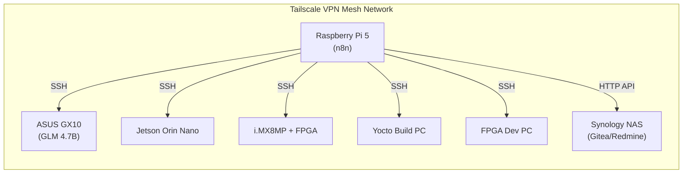
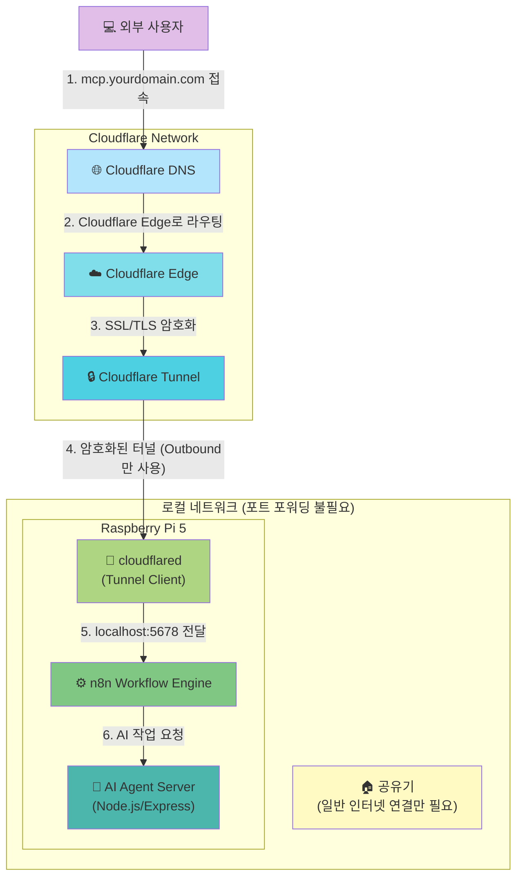
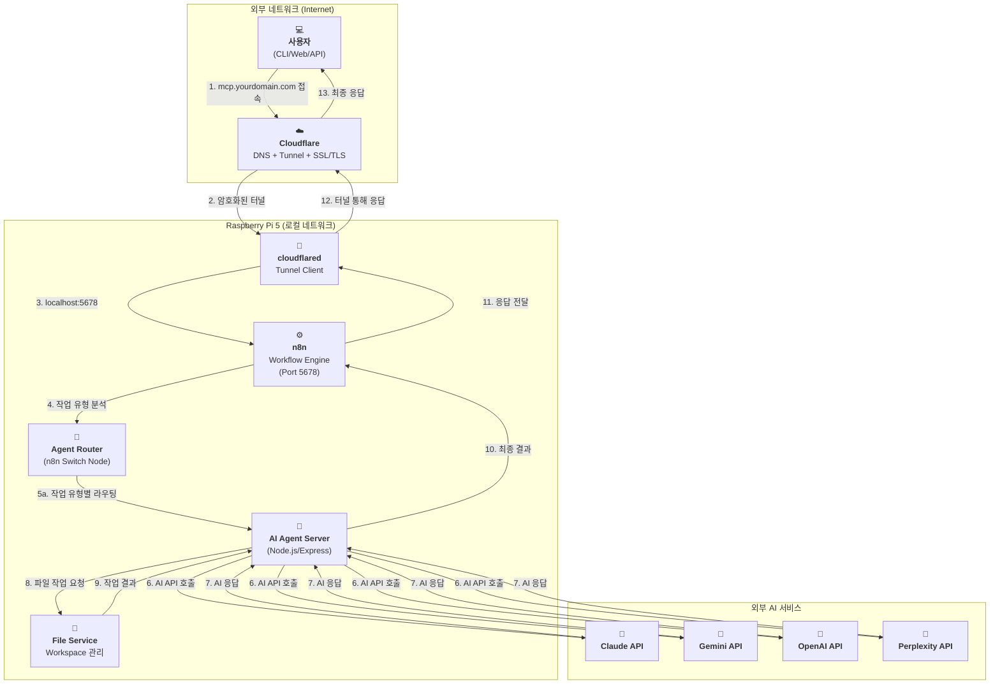

### **외부 접속 환경 구축 가이드 (Deployment Guide)**

> **📝 2026-01-12 업데이트:** Cloudflare Tunnel 기반 배포로 전환
>
> **제거된 요구사항:**
> - ~~포트 포워딩 (공유기 설정 불필요)~~
> - ~~DDNS (동적 IP 자동 해결)~~
> - ~~Let's Encrypt (Cloudflare SSL 자동 처리)~~
> - ~~Nginx (선택사항으로 변경)~~

## Cloudflare + Raspberry Pi 5 + n8n 기반 배포 아키텍처

외부에서 도메인으로 접속 가능한 셀프 호스팅 서버를 Cloudflare Tunnel을 활용하여 구축합니다.

| 구분 (Layer) | 필수 구성 요소 | 핵심 역할 (해야 할 일) | 추천 도구 / 서비스 | 구축 상태 | 변경일자 |
| :--- | :--- | :--- | :--- | :--- | :--- |
| **1. 하드웨어** | **Raspberry Pi 5** | n8n 및 AI Agent Server를 호스팅하는 물리적 서버 | Raspberry Pi 5 (8GB RAM) | ✅ 완료 | `[완료: 2026-01-12]` |
| **2. 주소 (Address)** | **도메인 (Domain)** | 고유한 인터넷 주소를 구매하고 소유합니다. | api.abyz-lab.work | ✅ 완료 | `[완료: 2026-01-12]` |
| **3. 연결 (Connection)** | **Cloudflare DNS** | 구매한 도메인을 Cloudflare DNS로 관리하며, Cloudflare 네트워크로 라우팅합니다. | Cloudflare (무료 플랜) | ✅ 완료 | `[완료: 2026-01-12]` |
| | **Cloudflare Tunnel** | 포트 포워딩 없이 암호화된 터널을 통해 외부 요청을 Raspberry Pi 5로 안전하게 전달합니다. | cloudflared (Tunnel: abyz-n8n) | ✅ 완료 | `[완료: 2026-01-12]` |
| | ~~**DDNS**~~ | **불필요** (Cloudflare Tunnel 사용 시 동적 IP 문제 자동 해결) | - | N/A | `[2026-01-12 제거]` |
| **4. 관문 (Gateway)** | ~~**포트 포워딩**~~ | **불필요** (Cloudflare Tunnel이 외부 접속 경로 제공) | - | N/A | `[2026-01-12 제거]` |
| **5. 워크플로우 엔진** | **n8n** | 모든 작업의 중앙 오케스트레이터로, AI 에이전트 호출 및 작업 관리를 담당합니다. | n8n Docker 컨테이너 (Port 5678) | ✅ 완료 | `[완료: 2026-01-12]` |
| **6. 서버 (Server)** | **AI Agent Server** | Node.js/Express 기반 서버로 각 AI 모델 어댑터를 제공합니다. | Node.js + Express + TypeScript | ⏳ 계획 | `[계획: 미구축]` |
| | ~~**리버스 프록시**~~ | **선택사항** (Cloudflare가 SSL/TLS 처리, n8n 직접 노출) | Nginx (선택사항) | ⏳ 계획 | `[계획: 선택사항]` |
| | **SSL/TLS 인증서** | Cloudflare가 자동으로 처리합니다. | Cloudflare (자동 SSL/TLS) | ✅ 완료 | `[완료: 2026-01-12]` |
| **7. 실행 (Runtime)** | **프로세스 매니저** | n8n 및 cloudflared가 안정적으로 24시간 동작하도록 관리합니다. | Docker (restart policy), systemd | ✅ 완료 | `[완료: 2026-01-12]` |
| **8. IDE 통합 AI** | **Claude Code** | 개발자 IDE에서 실시간 코드 작성 및 리팩토링 지원 | VSCode Extension + CLI | ✅ 구독 활성 | `[2026-01-12]` | `[2026-01-12 추가]`
| | **GitHub Copilot** | IDE 내장 코드 자동완성 및 제안 | VSCode/JetBrains 플러그인 | ✅ 구독 활성 | `[2026-01-12]` | `[2026-01-12 추가]`
| **9. 로컬 LLM** | **ASUS GX10 + GLM 4.7B** | n8n이 SSH를 통해 호출하는 반복 작업 자동화 (로그 분석, 코드 생성) | ASUS GX10 (SSH 접속) | ⏳ 계획 | `[2026-01-12]` | `[2026-01-12 추가]`
| **10. 하드웨어 검증** | **Jetson Orin Nano** | n8n이 SSH를 통해 AI 모델 추론 성능 검증 | Jetson Orin Nano (SSH) | ⏳ 계획 | `[2026-01-12]` | `[2026-01-12 추가]`
| | **i.MX8MP + FPGA** | n8n이 SSH를 통해 하드웨어 구현 검증 및 테스트 | Veriscite EVKIT (SSH) | ⏳ 계획 | `[2026-01-12]` | `[2026-01-12 추가]`
| **11. 빌드 자동화** | **Yocto Build PC** | n8n이 SSH로 Yocto 이미지 자동 빌드 | Ubuntu PC (SSH) | ⏳ 계획 | `[2026-01-12]` | `[2026-01-12 추가]`
| | **FPGA Dev PC** | n8n이 SSH로 FPGA 합성 및 시뮬레이션 자동화 | Vivado, Questa (SSH) | ⏳ 계획 | `[2026-01-12]` | `[2026-01-12 추가]`
| **12. DevOps** | **Gitea** | 셀프 호스팅 Git 저장소 (n8n이 API로 통합) | Synology NAS (HTTP API) | ✅ 구축 완료 | `[기존 설치]` | `[2026-01-12 추가]`
| | **Redmine** | 이슈 추적 및 작업 관리 (n8n이 API로 통합) | Synology NAS (HTTP API) | ✅ 구축 완료 | `[기존 설치]` | `[2026-01-12 추가]`
| **13. 네트워크** | **LAN + Tailscale VPN** | 모든 장비가 SSH 및 HTTP로 통신 가능 | 내부 네트워크 + Tailscale | ✅ 구축 완료 | `[기존 설치]` | `[2026-01-12 추가]`

## 네트워크 연결 흐름도 (Tailscale VPN 방식) `[2026-01-12 추가]`

아래 다이어그램은 Tailscale VPN을 통해 n8n이 모든 장비와 SSH로 연결되는 경로를 보여줍니다.



---

## 물리적 연결 흐름도 (Cloudflare Tunnel 방식)

아래 다이어그램은 Cloudflare Tunnel을 통해 외부 사용자가 Raspberry Pi 5의 n8n까지 연결되는 경로를 보여줍니다.



## 아키텍처 흐름도 (n8n 기반 워크플로우)

아래 다이어그램은 사용자가 외부에서 접속하여 n8n을 통해 AI 응답을 받기까지의 전체 과정을 보여줍니다.



---

## 4. 네트워크 토폴로지 (Tailscale VPN) `[2026-01-13 통합]`

> **📝 출처:** NETWORK_TOPOLOGY.md 통합 `[2026-01-13 통합]`

### 4.1 Tailscale VPN 구성

**개요:**
- 모든 장비가 동일한 Tailscale 네트워크에 연결
- SSH 접속 가능 (포트 22)
- 포트 포워딩 불필요 (Mesh VPN 구조)
- n8n이 모든 장비에 SSH Execute Command 노드로 원격 명령 실행

**장점:**
- **Zero Configuration:** 별도의 포트 포워딩 설정 불필요
- **보안:** 모든 통신이 WireGuard 프로토콜로 암호화
- **네트워크 독립:** 각 장비가 서로 다른 네트워크에 있어도 연결 가능
- **n8n 통합:** n8n SSH 노드에서 Tailscale IP로 직접 접속

---

### 4.2 장비별 연결 정보

> **⚠️ 주의:** 아래 IP 주소는 예시입니다. 실제 Tailscale IP로 교체하세요.

| 장비 | Tailscale IP | SSH 접속 명령 | 역할 | 구축 상태 |
|:---|:---|:---|:---|:---|
| Raspberry Pi 5 | `100.x.x.1` | `ssh pi@100.x.x.1` | n8n Hub (중앙 오케스트레이터) | ✅ 완료 |
| ASUS GX10 | `100.x.x.2` | `ssh user@100.x.x.2` | GLM 4.7B LLM (로컬 AI 추론) | ⏳ 계획 |
| Jetson Orin Nano | `100.x.x.3` | `ssh nvidia@100.x.x.3` | AI Inference (추론 성능 테스트) | ⏳ 계획 |
| i.MX8MP + FPGA | `100.x.x.4` | `ssh root@100.x.x.4` | Hardware Test (하드웨어 검증) | ⏳ 계획 |
| Yocto Build PC | `100.x.x.5` | `ssh user@100.x.x.5` | Yocto Build (이미지 자동 빌드) | ⏳ 계획 |
| FPGA Dev PC | `100.x.x.6` | `ssh user@100.x.x.6` | Vivado/Questa (합성/시뮬레이션) | ⏳ 계획 |
| Synology NAS | `100.x.x.7` | HTTP API | Gitea/Redmine (DevOps) | ✅ 완료 |

---

### 4.3 n8n SSH 연결 설정

#### Step 1: Raspberry Pi 5에서 SSH 키 생성

```bash
ssh-keygen -t ed25519 -C "n8n@raspberry-pi"
# 기본 경로에 저장: ~/.ssh/id_ed25519
```

#### Step 2: 각 장비에 공개 키 복사

```bash
ssh-copy-id -i ~/.ssh/id_ed25519.pub user@100.x.x.2  # ASUS GX10
ssh-copy-id -i ~/.ssh/id_ed25519.pub nvidia@100.x.x.3  # Jetson
ssh-copy-id -i ~/.ssh/id_ed25519.pub root@100.x.x.4    # i.MX8MP
ssh-copy-id -i ~/.ssh/id_ed25519.pub user@100.x.x.5    # Yocto PC
ssh-copy-id -i ~/.ssh/id_ed25519.pub user@100.x.x.6    # FPGA PC
```

#### Step 3: n8n SSH 노드 설정

1. n8n에서 **Credentials** → **New Credential** → **SSH**
2. **Authentication**: `Private Key`
3. **Private Key**: Raspberry Pi 5의 `~/.ssh/id_ed25519` 내용 복사
4. 각 장비별로 Credential 생성 (호스트 IP, 사용자명 다름)

---

### 4.4 n8n Execute Command 노드 사용 예시

#### 예시 1: ASUS GX10에서 GLM 4.7B 추론 실행

```json
{
  "authentication": "privateKey",
  "credentials": "ASUS GX10 SSH",
  "host": "100.x.x.2",
  "user": "user",
  "command": "python /opt/glm/inference.py --prompt '{{ $json.prompt }}'"
}
```

#### 예시 2: Jetson Orin Nano에서 AI 모델 테스트

```json
{
  "authentication": "privateKey",
  "credentials": "Jetson SSH",
  "host": "100.x.x.3",
  "user": "nvidia",
  "command": "python /home/nvidia/test_model.py --model {{ $json.model_path }}"
}
```

#### 예시 3: Yocto Build PC에서 이미지 빌드

```json
{
  "authentication": "privateKey",
  "credentials": "Yocto PC SSH",
  "host": "100.x.x.5",
  "user": "user",
  "command": "cd /opt/yocto && bitbake core-image-minimal"
}
```

---

### 4.5 Tailscale 설치 및 초기 설정

#### 모든 장비에 Tailscale 설치

**Ubuntu/Debian 계열 및 Raspberry Pi OS:**
```bash
curl -fsSL https://tailscale.com/install.sh | sh
sudo tailscale up
```

**Jetson (Ubuntu 기반):**
```bash
curl -fsSL https://tailscale.com/install.sh | sh
sudo tailscale up
```

#### Tailscale 네트워크 확인

```bash
tailscale status
```

**출력 예시:**
```
100.x.x.1   raspberry-pi-5     pi@           linux   active; relay
100.x.x.2   asus-gx10          user@         linux   active; direct
100.x.x.3   jetson-orin        nvidia@       linux   active; direct
...
```

---

### 4.6 네트워크 보안 권장사항

**1. SSH 키 관리:**
- 비밀 키(`id_ed25519`)는 Raspberry Pi 5에만 보관
- 정기적으로 키 로테이션 (6개월마다)

**2. Tailscale ACL (Access Control List):**
- Tailscale 대시보드에서 ACL 설정
- Raspberry Pi 5만 다른 장비에 접속 허용

**3. 방화벽 설정:**
- 각 장비에서 Tailscale 인터페이스만 SSH 허용
```bash
sudo ufw allow in on tailscale0 to any port 22
sudo ufw enable
```

---

### 4.7 네트워크 트러블슈팅

#### 문제 1: SSH 연결 실패
**원인:** SSH 키 인증 미설정
**해결:**
```bash
ssh-copy-id -i ~/.ssh/id_ed25519.pub user@100.x.x.2
```

#### 문제 2: Tailscale IP 연결 불가
**원인:** Tailscale 데몬 미실행
**해결:**
```bash
sudo systemctl start tailscaled
sudo tailscale up
```

#### 문제 3: n8n Execute Command 노드에서 Permission Denied
**원인:** SSH 키 권한 문제
**해결:**
```bash
chmod 600 ~/.ssh/id_ed25519
chmod 644 ~/.ssh/id_ed25519.pub
```

---

## 5. Cloudflare Tunnel 구축 상세 가이드 `[2026-01-13 통합]`

> **📝 출처:** n8n_cloudflare_tunnel_setup.md 통합 `[2026-01-13 통합]`
> **작성일:** 2026-01-12

### 5.1 사전 준비사항

- Raspberry Pi OS 최신 업데이트
- Docker & Docker Compose 설치
- Cloudflare 계정 및 도메인 준비 (api.abyz-lab.work)
- cloudflared 설치

---

### 5.2 n8n Docker 배포

#### docker-compose.yml 설정

```yaml
version: "3.8"

services:
  n8n:
    image: n8nio/n8n:latest
    container_name: n8n
    restart: unless-stopped
    ports:
      - "5678:5678"
    environment:
      - WEBHOOK_URL=https://api.abyz-lab.work
      - TZ=Asia/Seoul
      - N8N_SECURE_COOKIE=false
      - N8N_BASIC_AUTH_ACTIVE=true
      - N8N_BASIC_AUTH_USER=admin
      - N8N_BASIC_AUTH_PASSWORD=abyz@0809
      - N8N_HOST=0.0.0.0
      - N8N_PORT=5678
      - N8N_PROTOCOL=http
      - N8N_ENCRYPTION_KEY=~!duck5625
    volumes:
      - ./n8n_data:/home/node/.n8n
```

#### 컨테이너 실행

```bash
docker compose up -d
docker ps | grep n8n
```

---

### 5.3 Cloudflare Tunnel 설정

#### Step 1: 터널 생성

```bash
cloudflared tunnel create abyz-n8n
```

#### Step 2: config.yml 생성 (~/.cloudflared/config.yml)

```yaml
tunnel: abyz-n8n
credentials-file: /home/raspi/.cloudflared/7be6cf9a-dc35-4add-815c-da4810d9e0c5.json

ingress:
  - hostname: api.abyz-lab.work
    service: http://localhost:5678
  - service: http_status:404
```

#### Step 3: DNS CNAME 설정 (Cloudflare 대시보드)

- **호스트:** api
- **값:** 7be6cf9a-dc35-4add-815c-da4810d9e0c5.cfargotunnel.com
- **프록시:** 활성화 (주황 구름)

#### Step 4: cloudflared 서비스 등록 및 자동 시작

```bash
sudo cloudflared service install
sudo systemctl enable cloudflared
sudo systemctl start cloudflared
sudo systemctl status cloudflared
```

---

### 5.4 시스템 튜닝 (QUIC/UDP 버퍼 문제 해결)

#### /etc/sysctl.conf 수정

```bash
net.core.rmem_max=8388608
net.core.wmem_max=8388608
```

#### 적용

```bash
sudo sysctl -p
sudo systemctl restart cloudflared
```

**UDP 버퍼 에러 예시:**
```
failed to sufficiently increase receive buffer size (was: 208 kiB, wanted: 7168 kiB, got: 416 kiB)
```
→ sysctl.conf 수정으로 해결됨

---

### 5.5 최종 확인 및 검증

#### 1. n8n 컨테이너 상태 확인

```bash
docker ps | grep n8n
```

#### 2. Cloudflare Tunnel 상태 확인

```bash
sudo systemctl status cloudflared
cloudflared tunnel list
cloudflared tunnel info abyz-n8n
```

#### 3. 브라우저 접속 테스트

```
https://api.abyz-lab.work
```

---

### 5.6 자동 실행 보장

- **Docker 컨테이너:** `restart: unless-stopped` 설정으로 자동 재시작
- **Cloudflared 서비스:** `systemctl enable cloudflared`로 부팅 시 자동 실행
- **재부팅 후에도 자동 실행 확인 완료**

---

### 5.7 로그 및 디버깅

#### n8n 로그

```bash
docker-compose logs -f n8n
```

#### cloudflared 로그

```bash
journalctl -u cloudflared -f
```

---

## 6. 참고 자료

- [Cloudflare Tunnel 문서](https://developers.cloudflare.com/cloudflare-one/connections/connect-apps/)
- [n8n 공식 문서](https://docs.n8n.io/)
- [Tailscale 공식 문서](https://tailscale.com/kb/)
- [n8n SSH 노드 사용법](https://docs.n8n.io/integrations/builtin/core-nodes/n8n-nodes-base.ssh/)
- [WireGuard 프로토콜](https://www.wireguard.com/)