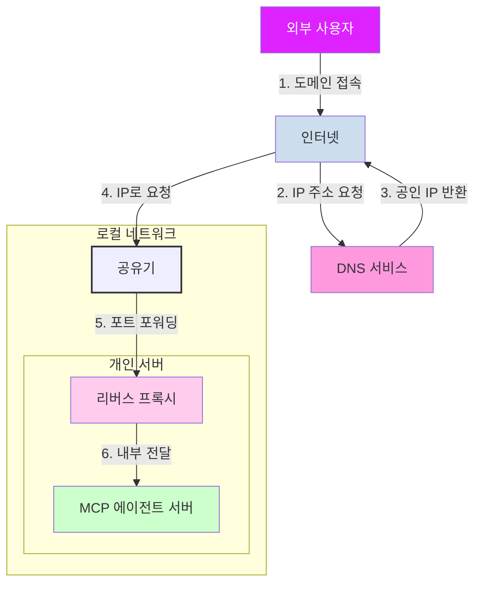
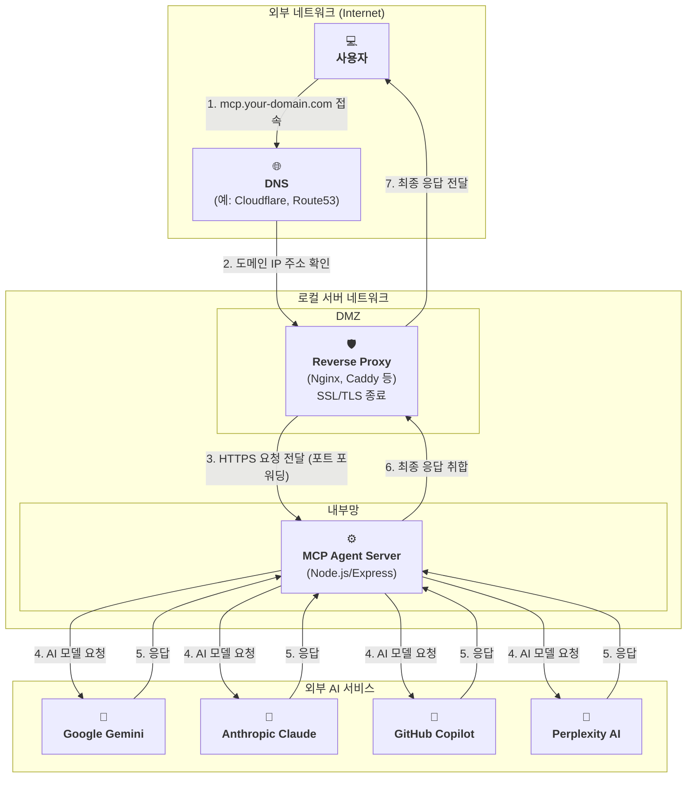

### **외부 접속 환경 구축 가이드 (Deployment Guide)**

외부에서 도메인으로 접속 가능한 셀프 호스팅 서버를 구축하기 위해 필요한 구성 요소와 역할은 다음과 같습니다.

| 구분 (Layer) | 필수 구성 요소 | 핵심 역할 (해야 할 일) | 추천 도구 / 서비스 |
| :--- | :--- | :--- | :--- |
| **1. 주소 (Address)** | **도메인 (Domain)** | 고유한 인터넷 주소 (`mcp.your-domain.com`)를 구매하고 소유합니다. | GoDaddy, Namecheap, 가비아 등 |
| **2. 연결 (Connection)** | **DNS (Domain Name System)** | 구매한 도메인 주소를 우리 집(사무실)의 인터넷 IP 주소로 연결(매핑)하는 설정을 합니다. | Cloudflare, 도메인 구매처의 DNS 설정 |
| | **DDNS (Dynamic DNS)** | IP 주소가 계속 바뀌는 일반 가정 환경에서, 변경된 IP를 도메인이 자동으로 추적하게 만듭니다. | `No-IP`, `DuckDNS` |
| **3. 관문 (Gateway)** | **공유기 (Router)** | 외부에서 들어오는 특정 요청(80, 443 포트)을 내부 서버 컴퓨터로 정확히 전달하도록 길을 열어줍니다. (`포트 포워딩`) | 사용 중인 유무선 공유기의 관리자 페이지 |
| **4. 서버 (Server)** | **리버스 프록시 (Reverse Proxy)**| 사용자의 HTTPS 요청을 안전하게 처리하고, 내부에서 실행중인 실제 애플리케이션으로 연결해주는 중계 서버 역할을 합니다. | `Nginx` |
| | **SSL 인증서** | 사용자와 서버 간의 통신을 암호화(HTTPS)합니다. | `Let's Encrypt` (Certbot을 통해 자동 발급) |
| **5. 실행 (Runtime)** | **프로세스 매니저** | 개발한 Node.js 서버가 꺼지거나 오류가 나도 자동으로 재시작해주며 안정적으로 24시간 동작하게 관리합니다. | `PM2` |

## 물리적 연결 흐름도 (Physical Connection Flow)

아래 다이어그램은 외부의 사용자가 도메인을 통해 로컬에 구축된 서버까지 연결되는 물리적인 경로를 보여줍니다.

## 아키텍처 흐름도 (Architecture Flowchart)

아래 다이어그램은 사용자가 외부에서 접속하여 MCP Agent Server를 통해 최종 AI 응답을 받기까지의 전체 과정을 보여줍니다.

