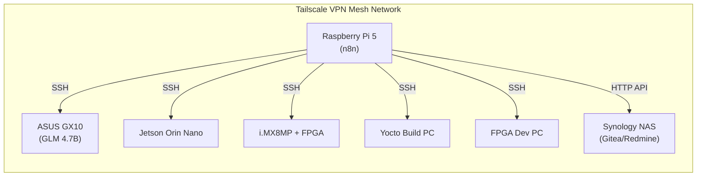
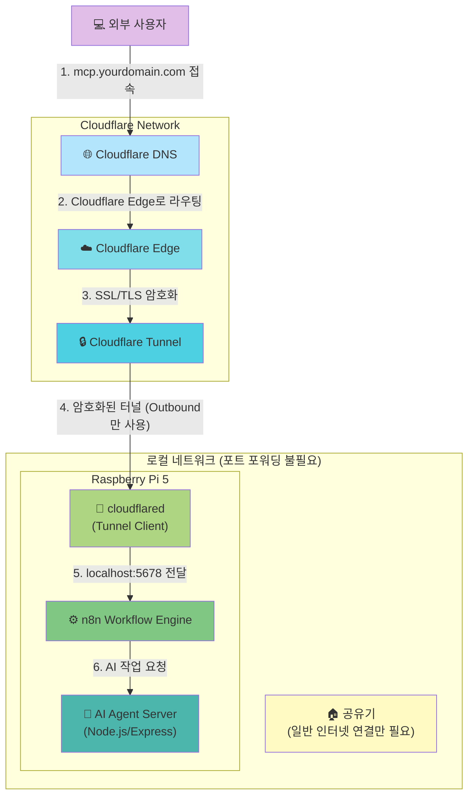
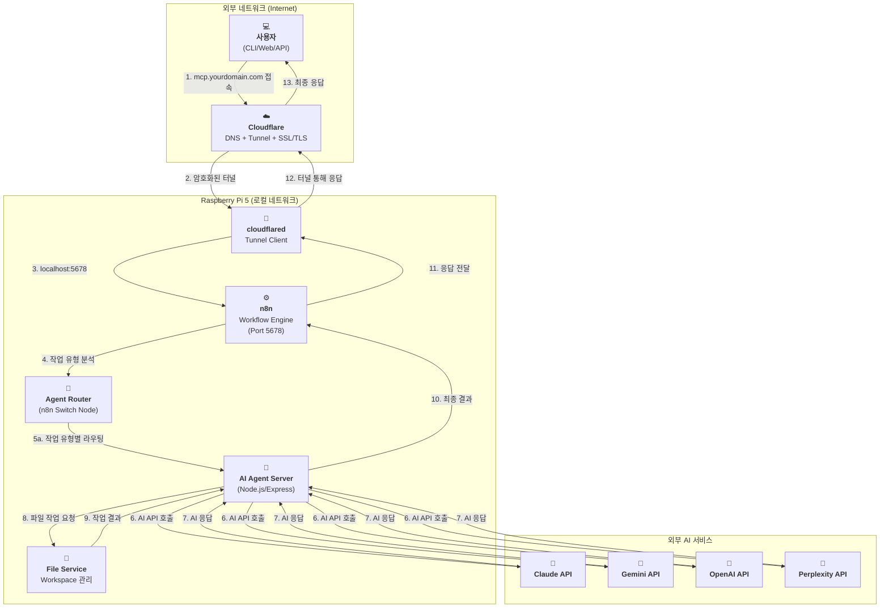

### **외부 접속 환경 구축 가이드 (Deployment Guide)**

> **📝 2026-01-12 업데이트:** Cloudflare Tunnel 기반 배포로 전환
>
> **제거된 요구사항:**
> - ~~포트 포워딩 (공유기 설정 불필요)~~
> - ~~DDNS (동적 IP 자동 해결)~~
> - ~~Let's Encrypt (Cloudflare SSL 자동 처리)~~
> - ~~Nginx (선택사항으로 변경)~~

## Cloudflare + Raspberry Pi 5 + n8n 기반 배포 아키텍처

외부에서 도메인으로 접속 가능한 셀프 호스팅 서버를 Cloudflare Tunnel을 활용하여 구축합니다.

| 구분 (Layer) | 필수 구성 요소 | 핵심 역할 (해야 할 일) | 추천 도구 / 서비스 | 구축 상태 | 변경일자 |
| :--- | :--- | :--- | :--- | :--- | :--- |
| **1. 하드웨어** | **Raspberry Pi 5** | n8n 및 AI Agent Server를 호스팅하는 물리적 서버 | Raspberry Pi 5 (8GB RAM) | ✅ 완료 | `[완료: 2026-01-12]` |
| **2. 주소 (Address)** | **도메인 (Domain)** | 고유한 인터넷 주소를 구매하고 소유합니다. | api.abyz-lab.work | ✅ 완료 | `[완료: 2026-01-12]` |
| **3. 연결 (Connection)** | **Cloudflare DNS** | 구매한 도메인을 Cloudflare DNS로 관리하며, Cloudflare 네트워크로 라우팅합니다. | Cloudflare (무료 플랜) | ✅ 완료 | `[완료: 2026-01-12]` |
| | **Cloudflare Tunnel** | 포트 포워딩 없이 암호화된 터널을 통해 외부 요청을 Raspberry Pi 5로 안전하게 전달합니다. | cloudflared (Tunnel: abyz-n8n) | ✅ 완료 | `[완료: 2026-01-12]` |
| | ~~**DDNS**~~ | **불필요** (Cloudflare Tunnel 사용 시 동적 IP 문제 자동 해결) | - | N/A | `[2026-01-12 제거]` |
| **4. 관문 (Gateway)** | ~~**포트 포워딩**~~ | **불필요** (Cloudflare Tunnel이 외부 접속 경로 제공) | - | N/A | `[2026-01-12 제거]` |
| **5. 워크플로우 엔진** | **n8n** | 모든 작업의 중앙 오케스트레이터로, AI 에이전트 호출 및 작업 관리를 담당합니다. | n8n Docker 컨테이너 (Port 5678) | ✅ 완료 | `[완료: 2026-01-12]` |
| **6. 서버 (Server)** | **AI Agent Server** | Node.js/Express 기반 서버로 각 AI 모델 어댑터를 제공합니다. | Node.js + Express + TypeScript | ⏳ 계획 | `[계획: 미구축]` |
| | ~~**리버스 프록시**~~ | **선택사항** (Cloudflare가 SSL/TLS 처리, n8n 직접 노출) | Nginx (선택사항) | ⏳ 계획 | `[계획: 선택사항]` |
| | **SSL/TLS 인증서** | Cloudflare가 자동으로 처리합니다. | Cloudflare (자동 SSL/TLS) | ✅ 완료 | `[완료: 2026-01-12]` |
| **7. 실행 (Runtime)** | **프로세스 매니저** | n8n 및 cloudflared가 안정적으로 24시간 동작하도록 관리합니다. | Docker (restart policy), systemd | ✅ 완료 | `[완료: 2026-01-12]` |
| **8. IDE 통합 AI** | **Claude Code** | 개발자 IDE에서 실시간 코드 작성 및 리팩토링 지원 | VSCode Extension + CLI | ✅ 구독 활성 | `[2026-01-12]` | `[2026-01-12 추가]`
| | **GitHub Copilot** | IDE 내장 코드 자동완성 및 제안 | VSCode/JetBrains 플러그인 | ✅ 구독 활성 | `[2026-01-12]` | `[2026-01-12 추가]`
| **9. 로컬 LLM** | **ASUS GX10 + GLM 4.7B** | n8n이 SSH를 통해 호출하는 반복 작업 자동화 (로그 분석, 코드 생성) | ASUS GX10 (SSH 접속) | ⏳ 계획 | `[2026-01-12]` | `[2026-01-12 추가]`
| **10. 하드웨어 검증** | **Jetson Orin Nano** | n8n이 SSH를 통해 AI 모델 추론 성능 검증 | Jetson Orin Nano (SSH) | ⏳ 계획 | `[2026-01-12]` | `[2026-01-12 추가]`
| | **i.MX8MP + FPGA** | n8n이 SSH를 통해 하드웨어 구현 검증 및 테스트 | Veriscite EVKIT (SSH) | ⏳ 계획 | `[2026-01-12]` | `[2026-01-12 추가]`
| **11. 빌드 자동화** | **Yocto Build PC** | n8n이 SSH로 Yocto 이미지 자동 빌드 | Ubuntu PC (SSH) | ⏳ 계획 | `[2026-01-12]` | `[2026-01-12 추가]`
| | **FPGA Dev PC** | n8n이 SSH로 FPGA 합성 및 시뮬레이션 자동화 | Vivado, Questa (SSH) | ⏳ 계획 | `[2026-01-12]` | `[2026-01-12 추가]`
| **12. DevOps** | **Gitea** | 셀프 호스팅 Git 저장소 (n8n이 API로 통합) | Synology NAS (HTTP API) | ✅ 구축 완료 | `[기존 설치]` | `[2026-01-12 추가]`
| | **Redmine** | 이슈 추적 및 작업 관리 (n8n이 API로 통합) | Synology NAS (HTTP API) | ✅ 구축 완료 | `[기존 설치]` | `[2026-01-12 추가]`
| **13. 네트워크** | **LAN + Tailscale VPN** | 모든 장비가 SSH 및 HTTP로 통신 가능 | 내부 네트워크 + Tailscale | ✅ 구축 완료 | `[기존 설치]` | `[2026-01-12 추가]`

## 네트워크 연결 흐름도 (Tailscale VPN 방식) `[2026-01-12 추가]`

아래 다이어그램은 Tailscale VPN을 통해 n8n이 모든 장비와 SSH로 연결되는 경로를 보여줍니다.

---

## 물리적 연결 흐름도 (Cloudflare Tunnel 방식)

아래 다이어그램은 Cloudflare Tunnel을 통해 외부 사용자가 Raspberry Pi 5의 n8n까지 연결되는 경로를 보여줍니다.

## 아키텍처 흐름도 (n8n 기반 워크플로우)

아래 다이어그램은 사용자가 외부에서 접속하여 n8n을 통해 AI 응답을 받기까지의 전체 과정을 보여줍니다.

