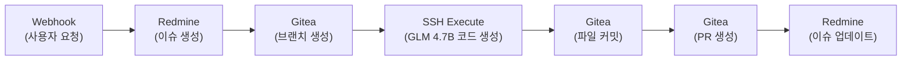

# DevOps 통합 가이드 (Gitea + Redmine)

> **📝 2026-01-12 작성:** Synology NAS의 Gitea + Redmine과 n8n 통합 가이드 `[2026-01-12 신규]`

## 1. Gitea API 연동

### 1.1 Gitea 접근 토큰 생성

**Step 1: Gitea 웹 UI 접속**
```
http://nas-ip:3000
```

**Step 2: 사용자 설정 → Applications → Generate New Token**
- **Token Name:** `n8n-automation`
- **권한 선택:**
  - `repo` (전체 저장소 제어)
  - `write:repository` (브랜치, 커밋, PR 생성)

**Step 3: 생성된 토큰 복사 후 n8n Credential 등록**
- n8n → Credentials → New Credential → HTTP Header Auth
- **Name:** `Gitea API Token`
- **Header Name:** `Authorization`
- **Header Value:** `token YOUR_GITEA_TOKEN`

---

### 1.2 Gitea API 예시 (n8n HTTP Request 노드)

#### 예시 1: 브랜치 생성
```json
{
  "method": "POST",
  "url": "http://nas-ip:3000/api/v1/repos/{owner}/{repo}/branches",
  "authentication": "predefinedCredentialType",
  "credentialsType": "httpHeaderAuth",
  "credentials": "Gitea API Token",
  "body": {
    "new_branch_name": "{{ $json.branch_name }}",
    "old_branch_name": "main"
  }
}
```

#### 예시 2: 파일 생성 및 커밋
```json
{
  "method": "POST",
  "url": "http://nas-ip:3000/api/v1/repos/{owner}/{repo}/contents/{file_path}",
  "authentication": "predefinedCredentialType",
  "credentialsType": "httpHeaderAuth",
  "credentials": "Gitea API Token",
  "body": {
    "content": "{{ $base64($json.file_content) }}",
    "message": "{{ $json.commit_message }}",
    "branch": "{{ $json.branch_name }}"
  }
}
```

**주의:** `content` 필드는 Base64 인코딩 필요

#### 예시 3: Pull Request 생성
```json
{
  "method": "POST",
  "url": "http://nas-ip:3000/api/v1/repos/{owner}/{repo}/pulls",
  "authentication": "predefinedCredentialType",
  "credentialsType": "httpHeaderAuth",
  "credentials": "Gitea API Token",
  "body": {
    "title": "{{ $json.pr_title }}",
    "head": "{{ $json.source_branch }}",
    "base": "main",
    "body": "{{ $json.pr_description }}"
  }
}
```

---

## 2. Redmine API 연동

### 2.1 Redmine API 키 확인

**Step 1: Redmine 웹 UI 접속**
```
http://nas-ip/redmine
```

**Step 2: My account → API access key**
- **Show** 버튼 클릭하여 API 키 복사

**Step 3: n8n Credential 등록**
- n8n → Credentials → New Credential → HTTP Header Auth
- **Name:** `Redmine API Key`
- **Header Name:** `X-Redmine-API-Key`
- **Header Value:** `YOUR_REDMINE_API_KEY`

---

### 2.2 Redmine API 예시 (n8n HTTP Request 노드)

#### 예시 1: 이슈 생성
```json
{
  "method": "POST",
  "url": "http://nas-ip/redmine/issues.json",
  "authentication": "predefinedCredentialType",
  "credentialsType": "httpHeaderAuth",
  "credentials": "Redmine API Key",
  "body": {
    "issue": {
      "project_id": 1,
      "subject": "{{ $json.task_title }}",
      "description": "{{ $json.task_description }}",
      "priority_id": 2,
      "assigned_to_id": 1
    }
  }
}
```

**응답 예시:**
```json
{
  "issue": {
    "id": 123,
    "subject": "신규 기능 개발",
    "status": {
      "id": 1,
      "name": "New"
    }
  }
}
```

#### 예시 2: 이슈 상태 업데이트
```json
{
  "method": "PUT",
  "url": "http://nas-ip/redmine/issues/{{ $json.issue_id }}.json",
  "authentication": "predefinedCredentialType",
  "credentialsType": "httpHeaderAuth",
  "credentials": "Redmine API Key",
  "body": {
    "issue": {
      "status_id": 3,
      "notes": "{{ $json.update_message }}"
    }
  }
}
```

**Redmine 상태 ID:**
- `1` = New (신규)
- `2` = In Progress (진행 중)
- `3` = Resolved (해결됨)
- `5` = Closed (종료)

#### 예시 3: 이슈에 코멘트 추가
```json
{
  "method": "PUT",
  "url": "http://nas-ip/redmine/issues/{{ $json.issue_id }}.json",
  "authentication": "predefinedCredentialType",
  "credentialsType": "httpHeaderAuth",
  "credentials": "Redmine API Key",
  "body": {
    "issue": {
      "notes": "{{ $json.comment_text }}"
    }
  }
}
```

---

## 3. n8n 워크플로우 예시

### 3.1 전체 워크플로우: 이슈 생성 → 브랜치 생성 → 코드 작성 → PR 생성



### 3.2 n8n 워크플로우 JSON 예시

**노드 1: Webhook (사용자 요청 수신)**
```json
{
  "name": "Webhook",
  "type": "n8n-nodes-base.webhook",
  "parameters": {
    "path": "create-task",
    "responseMode": "responseNode",
    "method": "POST"
  }
}
```

**노드 2: Redmine 이슈 생성**
```json
{
  "name": "Create Redmine Issue",
  "type": "n8n-nodes-base.httpRequest",
  "parameters": {
    "method": "POST",
    "url": "http://nas-ip/redmine/issues.json",
    "authentication": "predefinedCredentialType",
    "credentialsType": "httpHeaderAuth",
    "credentials": "Redmine API Key",
    "body": "={{ { issue: { project_id: 1, subject: $json.task_title, description: $json.task_description } } }}"
  }
}
```

**노드 3: Gitea 브랜치 생성**
```json
{
  "name": "Create Gitea Branch",
  "type": "n8n-nodes-base.httpRequest",
  "parameters": {
    "method": "POST",
    "url": "http://nas-ip:3000/api/v1/repos/owner/repo/branches",
    "authentication": "predefinedCredentialType",
    "credentialsType": "httpHeaderAuth",
    "credentials": "Gitea API Token",
    "body": "={{ { new_branch_name: 'feature/issue-' + $json.issue.id, old_branch_name: 'main' } }}"
  }
}
```

**노드 4: SSH Execute (GLM 4.7B 코드 생성)**
```json
{
  "name": "Generate Code with GLM",
  "type": "n8n-nodes-base.ssh",
  "credentials": {
    "ssh": "ASUS GX10 SSH"
  },
  "parameters": {
    "command": "python /opt/glm/generate_code.py --task '{{ $json.task_description }}'"
  }
}
```

**노드 5: Gitea 파일 커밋**
```json
{
  "name": "Commit to Gitea",
  "type": "n8n-nodes-base.httpRequest",
  "parameters": {
    "method": "POST",
    "url": "http://nas-ip:3000/api/v1/repos/owner/repo/contents/new_file.py",
    "authentication": "predefinedCredentialType",
    "credentialsType": "httpHeaderAuth",
    "credentials": "Gitea API Token",
    "body": "={{ { content: $base64($json.generated_code), message: 'Generated by GLM 4.7B', branch: 'feature/issue-' + $('Create Redmine Issue').first().json.issue.id } }}"
  }
}
```

**노드 6: Gitea PR 생성**
```json
{
  "name": "Create Pull Request",
  "type": "n8n-nodes-base.httpRequest",
  "parameters": {
    "method": "POST",
    "url": "http://nas-ip:3000/api/v1/repos/owner/repo/pulls",
    "authentication": "predefinedCredentialType",
    "credentialsType": "httpHeaderAuth",
    "credentials": "Gitea API Token",
    "body": "={{ { title: 'Auto-generated: ' + $('Create Redmine Issue').first().json.issue.subject, head: 'feature/issue-' + $('Create Redmine Issue').first().json.issue.id, base: 'main', body: 'Closes #' + $('Create Redmine Issue').first().json.issue.id } }}"
  }
}
```

**노드 7: Redmine 이슈 업데이트**
```json
{
  "name": "Update Redmine Issue",
  "type": "n8n-nodes-base.httpRequest",
  "parameters": {
    "method": "PUT",
    "url": "http://nas-ip/redmine/issues/{{ $('Create Redmine Issue').first().json.issue.id }}.json",
    "authentication": "predefinedCredentialType",
    "credentialsType": "httpHeaderAuth",
    "credentials": "Redmine API Key",
    "body": "={{ { issue: { status_id: 2, notes: 'PR created: ' + $json.html_url } } }}"
  }
}
```

---

## 4. Redmine과 Gitea 연동 팁

### 4.1 커밋 메시지에 Redmine 이슈 번호 포함

Gitea 커밋 메시지에 `refs #123` 또는 `closes #123` 형식 포함 시 Redmine과 자동 연결:

```json
{
  "message": "Fix bug in auth module\n\ncloses #{{ $json.issue_id }}",
  "branch": "feature/issue-{{ $json.issue_id }}"
}
```

### 4.2 PR 설명에 Redmine 이슈 링크 추가

```json
{
  "body": "## Summary\n자동 생성된 코드\n\n## Related Issues\n- Redmine: http://nas-ip/redmine/issues/{{ $json.issue_id }}"
}
```

---

## 5. 트러블슈팅

### 문제 1: Gitea API 403 Forbidden
**원인:** API 토큰 권한 부족
**해결:** Gitea에서 `repo` 및 `write:repository` 권한 활성화

### 문제 2: Redmine API 422 Unprocessable Entity
**원인:** 필수 필드 누락 (`project_id`, `subject`)
**해결:** API 요청에 `project_id`와 `subject` 포함 확인

### 문제 3: Base64 인코딩 오류
**원인:** Gitea API는 파일 내용을 Base64로 요구
**해결:** n8n 표현식 사용
```javascript
$base64($json.file_content)
```

---

## 6. 보안 권장사항

1. **API 키 관리:**
   - n8n Credential 암호화 저장
   - 정기적으로 API 키 로테이션

2. **네트워크 제한:**
   - Gitea/Redmine은 내부 네트워크에서만 접근
   - Cloudflare Tunnel을 통한 외부 접근 시 Cloudflare Access 설정

3. **권한 최소화:**
   - n8n용 API 토큰은 필요한 권한만 부여
   - Gitea: `repo`, `write:repository`
   - Redmine: 이슈 생성/업데이트만 허용

---

## 7. 참고 자료

- [Gitea API 문서](https://docs.gitea.com/api/1.20/)
- [Redmine REST API](https://www.redmine.org/projects/redmine/wiki/Rest_api)
- [n8n HTTP Request 노드](https://docs.n8n.io/integrations/builtin/core-nodes/n8n-nodes-base.httprequest/)
