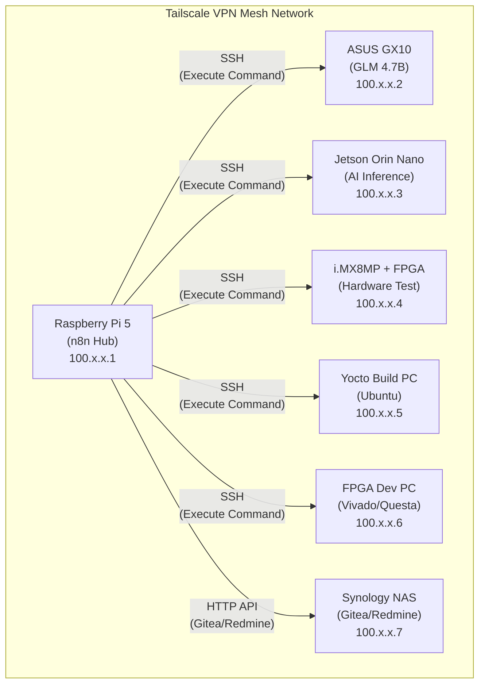

# 네트워크 토폴로지 및 연결 가이드

> **📝 2026-01-12 작성:** Tailscale VPN 기반 네트워크 연결 구조 문서화 `[2026-01-12 신규]`

## 1. Tailscale VPN 구성

### 개요
- 모든 장비가 동일한 Tailscale 네트워크에 연결
- SSH 접속 가능 (포트 22)
- 포트 포워딩 불필요 (Mesh VPN 구조)
- n8n이 모든 장비에 SSH Execute Command 노드로 원격 명령 실행

### 장점
- **Zero Configuration:** 별도의 포트 포워딩 설정 불필요
- **보안:** 모든 통신이 WireGuard 프로토콜로 암호화
- **네트워크 독립:** 각 장비가 서로 다른 네트워크에 있어도 연결 가능
- **n8n 통합:** n8n SSH 노드에서 Tailscale IP로 직접 접속

---

## 2. 장비별 연결 정보

> **주의:** 아래 IP 주소는 예시입니다. 실제 Tailscale IP로 교체하세요.

| 장비 | Tailscale IP | SSH 접속 명령 | 역할 | 구축 상태 |
|:---|:---|:---|:---|:---|
| Raspberry Pi 5 | `100.x.x.1` | `ssh pi@100.x.x.1` | n8n Hub (중앙 오케스트레이터) | ✅ 완료 |
| ASUS GX10 | `100.x.x.2` | `ssh user@100.x.x.2` | GLM 4.7B LLM (로컬 AI 추론) | ⏳ 계획 |
| Jetson Orin Nano | `100.x.x.3` | `ssh nvidia@100.x.x.3` | AI Inference (추론 성능 테스트) | ⏳ 계획 |
| i.MX8MP + FPGA | `100.x.x.4` | `ssh root@100.x.x.4` | Hardware Test (하드웨어 검증) | ⏳ 계획 |
| Yocto Build PC | `100.x.x.5` | `ssh user@100.x.x.5` | Yocto Build (이미지 자동 빌드) | ⏳ 계획 |
| FPGA Dev PC | `100.x.x.6` | `ssh user@100.x.x.6` | Vivado/Questa (합성/시뮬레이션) | ⏳ 계획 |
| Synology NAS | `100.x.x.7` | HTTP API | Gitea/Redmine (DevOps) | ✅ 완료 |

---

## 3. n8n SSH 연결 설정

### 3.1 SSH 키 인증 설정

**Step 1: Raspberry Pi 5에서 SSH 키 생성**
```bash
ssh-keygen -t ed25519 -C "n8n@raspberry-pi"
# 기본 경로에 저장: ~/.ssh/id_ed25519
```

**Step 2: 각 장비에 공개 키 복사**
```bash
ssh-copy-id -i ~/.ssh/id_ed25519.pub user@100.x.x.2  # ASUS GX10
ssh-copy-id -i ~/.ssh/id_ed25519.pub nvidia@100.x.x.3  # Jetson
ssh-copy-id -i ~/.ssh/id_ed25519.pub root@100.x.x.4    # i.MX8MP
ssh-copy-id -i ~/.ssh/id_ed25519.pub user@100.x.x.5    # Yocto PC
ssh-copy-id -i ~/.ssh/id_ed25519.pub user@100.x.x.6    # FPGA PC
```

**Step 3: n8n SSH 노드 설정**
1. n8n에서 **Credentials** → **New Credential** → **SSH**
2. **Authentication**: `Private Key`
3. **Private Key**: Raspberry Pi 5의 `~/.ssh/id_ed25519` 내용 복사
4. 각 장비별로 Credential 생성 (호스트 IP, 사용자명 다름)

---

### 3.2 n8n Execute Command 노드 사용 예시

#### 예시 1: ASUS GX10에서 GLM 4.7B 추론 실행
```json
{
  "authentication": "privateKey",
  "credentials": "ASUS GX10 SSH",
  "host": "100.x.x.2",
  "user": "user",
  "command": "python /opt/glm/inference.py --prompt '{{ $json.prompt }}'"
}
```

#### 예시 2: Jetson Orin Nano에서 AI 모델 테스트
```json
{
  "authentication": "privateKey",
  "credentials": "Jetson SSH",
  "host": "100.x.x.3",
  "user": "nvidia",
  "command": "python /home/nvidia/test_model.py --model {{ $json.model_path }}"
}
```

#### 예시 3: Yocto Build PC에서 이미지 빌드
```json
{
  "authentication": "privateKey",
  "credentials": "Yocto PC SSH",
  "host": "100.x.x.5",
  "user": "user",
  "command": "cd /opt/yocto && bitbake core-image-minimal"
}
```

---

## 4. 네트워크 흐름도



---

## 5. Tailscale 설치 및 초기 설정

### 5.1 모든 장비에 Tailscale 설치

**Ubuntu/Debian 계열**
```bash
curl -fsSL https://tailscale.com/install.sh | sh
sudo tailscale up
```

**Raspberry Pi OS**
```bash
curl -fsSL https://tailscale.com/install.sh | sh
sudo tailscale up
```

**Jetson (Ubuntu 기반)**
```bash
curl -fsSL https://tailscale.com/install.sh | sh
sudo tailscale up
```

### 5.2 Tailscale 네트워크 확인
```bash
tailscale status
```

**출력 예시:**
```
100.x.x.1   raspberry-pi-5     pi@           linux   active; relay
100.x.x.2   asus-gx10          user@         linux   active; direct
100.x.x.3   jetson-orin        nvidia@       linux   active; direct
...
```

---

## 6. 트러블슈팅

### 문제 1: SSH 연결 실패
**원인:** SSH 키 인증 미설정
**해결:**
```bash
ssh-copy-id -i ~/.ssh/id_ed25519.pub user@100.x.x.2
```

### 문제 2: Tailscale IP 연결 불가
**원인:** Tailscale 데몬 미실행
**해결:**
```bash
sudo systemctl start tailscaled
sudo tailscale up
```

### 문제 3: n8n Execute Command 노드에서 Permission Denied
**원인:** SSH 키 권한 문제
**해결:**
```bash
chmod 600 ~/.ssh/id_ed25519
chmod 644 ~/.ssh/id_ed25519.pub
```

---

## 7. 보안 권장사항

1. **SSH 키 관리:**
   - 비밀 키(`id_ed25519`)는 Raspberry Pi 5에만 보관
   - 정기적으로 키 로테이션 (6개월마다)

2. **Tailscale ACL (Access Control List):**
   - Tailscale 대시보드에서 ACL 설정
   - Raspberry Pi 5만 다른 장비에 접속 허용

3. **방화벽 설정:**
   - 각 장비에서 Tailscale 인터페이스만 SSH 허용
   ```bash
   sudo ufw allow in on tailscale0 to any port 22
   sudo ufw enable
   ```

---

## 8. 참고 자료

- [Tailscale 공식 문서](https://tailscale.com/kb/)
- [n8n SSH 노드 사용법](https://docs.n8n.io/integrations/builtin/core-nodes/n8n-nodes-base.ssh/)
- [WireGuard 프로토콜](https://www.wireguard.com/)
