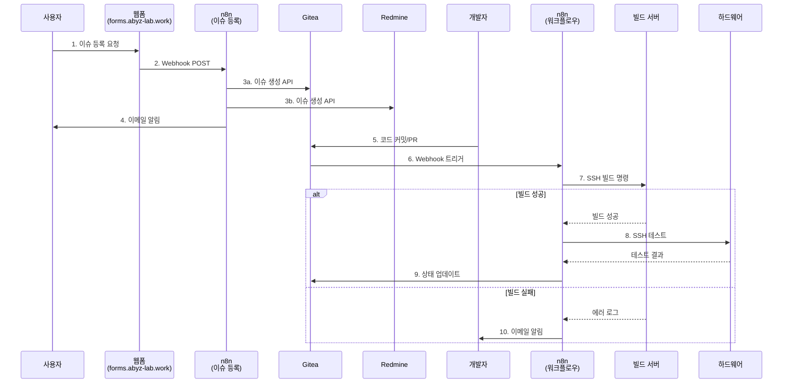

# PRD 통합 가이드

> **문서 버전:** 1.0.0
> **최종 업데이트:** 2026-01-27
> **대상:** issue-register-prd.md (v1.1.0), mcp-server-prd.md (v2.0.0)

---

## 📋 개요 (Overview)

### 목적

본 가이드는 MCP-Agent-Server 프로젝트의 두 핵심 PRD 문서 간 통합 전략과 상호 연계 지점을 정의합니다:

1. **issue-register-prd.md:** 외부 이슈 등록 시스템 (사용자 요청 → Gitea/Redmine)
2. **mcp-server-prd.md:** 하드웨어 개발 워크플로우 자동화 (Gitea Webhook → 빌드/테스트 → 하드웨어 검증)

### 통합 필요성

두 시스템은 n8n 워크플로우 엔진을 통해 연결됩니다:

- **이슈 등록 시스템**이 사용자 요청을 Gitea/Redmine에 등록
- **워크플로우 자동화 시스템**이 Gitea Webhook을 감지하고 자동으로 빌드/테스트 실행
- 두 시스템 간 원활한 데이터 교환을 통해 완전한 개발 자동화 파이프라인 구성

---

## 🔗 공통 컴포넌트 (Common Components)

### 1. n8n 워크플로우 엔진

**역할:** 두 시스템 모두의 중심 오케스트레이터

**공통 요소:**

#### Webhook 트리거
```yaml
이슈 등록 시스템:
  - 형태: HTTP POST (JSON)
  - 출처: 외부 웹폼 (forms.abyz-lab.work)
  - 데이터: 프로젝트, 제목, 이슈 타입, 우선순위, 내용

워크플로우 자동화:
  - 형태: HTTP POST (JSON)
  - 출처: Gitea Webhook
  - 데이터: 커밋 정보, 브랜치, 작성자, 변경 파일
```

#### SSH 원격 실행
```yaml
이슈 등록 시스템:
  - 대상: Synology NAS (Gitea, Redmine)
  - 목적: REST API 호출로 이슈 생성
  - 인증: API Token + Tailscale VPN

워크플로우 자동화:
  - 대상: 빌드 서버, 하드웨어 검증 장비
  - 목적: 원격 빌드/테스트 실행
  - 인증: SSH Key + Tailscale VPN
```

#### 에러 핸들링
```yaml
공통 패턴:
  - 재시도 로직: 최대 3회 (지수 백오프)
  - 알림: Gmail SMTP로 관리자에게 에러 통보
  - 로그: n8n 실행 내역 + 오류 메시지 저장
  - 폴백: 실패 시 수동 개입 요청 이메일 발송
```

### 2. Cloudflare Tunnel

**역할:** 외부 HTTPS 접속을 위한 보안 터널

**공통 활용:**
- `forms.abyz-lab.work`: 이슈 등록 웹폼 접근
- `api.abyz-lab.work`: n8n Webhook 엔드포인트 노출

**보안:**
- TLS 1.3 암호화
- 포트 포워딩 불필요
- DDNS 자동 관리

---

## 🔌 API 연동 통합 (API Integration)

### 인증 방법 통일

**Gitea API:**
```yaml
엔드포인트: https://gitea.internal/api/v1
인증:
  - 방식: Bearer Token
  - 헤더: Authorization: token <ACCESS_TOKEN>
  - 저장: n8n Credentials Manager (암호화)
  - 만료: 무기한 (관리자가 수동 갱신)

사용 시스템:
  - 이슈 등록: 이슈 생성, 라벨 추가
  - 워크플로우: 브랜치 생성, 커밋 상태 업데이트
```

**Redmine API:**
```yaml
엔드포인트: https://redmine.internal/issues.json
인증:
  - 방식: API Key
  - 헤더: X-Redmine-API-Key: <API_KEY>
  - 저장: n8n Credentials Manager (암호화)
  - 만료: 무기한 (관리자가 수동 갱신)

사용 시스템:
  - 이슈 등록: 이슈 생성, 프로젝트 매핑
  - 워크플로우: 이슈 상태 업데이트 (선택)
```

### 에러 응답 표준화

**공통 에러 포맷:**
```json
{
  "success": false,
  "error": {
    "code": "API_RATE_LIMIT_EXCEEDED",
    "message": "Gitea API 요청 한도 초과",
    "details": {
      "retry_after": 60,
      "request_id": "req_abc123"
    }
  }
}
```

**에러 코드 정의:**
```yaml
공통 에러:
  - NETWORK_ERROR: Tailscale VPN 연결 실패
  - AUTH_FAILED: API 토큰 만료 또는 유효하지 않음
  - RATE_LIMIT: API 요청 한도 초과
  - TIMEOUT: 요청 시간 초과 (30초)

이슈 등록 전용:
  - MISSING_REQUIRED_FIELD: 필수 필드 누락
  - INVALID_PROJECT: 존재하지 않는 프로젝트
  - ISSUE_CREATION_FAILED: 이슈 생성 실패

워크플로우 전용:
  - BUILD_FAILED: 빌드 실패
  - TEST_FAILED: 테스트 실패
  - HARDWARE_UNAVAILABLE: 하드웨어 장비 연결 불가
```

---

## 🔄 데이터 플로우 (Data Flow)

### 통합 개발 파이프라인



### 데이터 교환 방식

**1단계: 이슈 등록 (issue-register-prd.md)**

```yaml
입력:
  - 출처: 웹폼 (forms.abyz-lab.work)
  - 형식: application/json
  - 필드:
      - project: string (필수)
      - title: string (필수)
      - type: string (버그/기능/작업) (필수)
      - priority: string (낮음/보통/높음/치명적) (필수)
      - description: string (필수)
      - requester: object {name, email} (선택)

처리:
  - n8n Webhook 수신
  - 필드 검증
  - Gitea/Redmine API 호출
  - 이메일 알림 발송

출력:
  - Gitea Issue 생성 (issue URL, 번호)
  - Redmine Issue 생성 (issue URL, 번호)
  - 사용자에게 "등록 완료" 메시지
```

**2단계: 개발 자동화 (mcp-server-prd.md)**

```yaml
입력:
  - 출처: Gitea Webhook
  - 형식: application/json
  - 필드:
      - ref: string (브랜치/태그)
      - repository: object {url, name}
      - pusher: object {name, email}
      - commits: array [{id, message, timestamp}]

처리:
  - n8n Webhook 수신
  - 브랜치/커밋 분석
  - SSH로 빌드 서버에 접속
  - 빌드 스크립트 실행
  - 테스트 자동 실행

출력:
  - 빌드 성공/실패 상태
  - 테스트 결과 (pass/fail)
  - Gitea Status Check 업데이트
  - 실패 시 이메일 알림
```

---

## 🚀 구현 우선순위 (Implementation Priority)

### 단계 1: 기본 인프라 공유 ✅ [완료: 2026-01-26]

**목표:** 두 시스템이 공통으로 사용하는 인프라 구축

- ✅ Raspberry Pi 5 + n8n Docker 컨테이너
- ✅ Cloudflare Tunnel (forms.abyz-lab.work, api.abyz-lab.work)
- ✅ Synology NAS (Gitea + Redmine)
- ✅ Tailscale VPN 네트워크
- ✅ Gmail SMTP 알림 시스템

### 단계 2: 이슈 등록 시스템 완성 ⏳ [진행 중: 2026-01-27 ~]

**목표:** 웹폼 → Gitea/Redmine 자동 이슈 생성 구현

- ⏳ n8n → Gitea API 연동
- ⏳ n8n → Redmine API 연동
- ⏳ 입력값 검증 강화
- ⏳ 에러 핸들링 및 재시도 로직

### 단계 3: 워크플로우 자동화 기반 구축 ⏳ [계획: 2026-02-01 ~]

**목표:** Gitea Webhook → 빌드/테스트 파이프라인 구현

- ⏳ Gitea Webhook 트리거 설정
- ⏳ SSH로 빌드 서버 연결
- ⏳ 빌드 스크립트 자동화 (CMake, make, Jenkins)
- ⏳ 테스트 결과 수집

### 단계 4: 로컬 LLM 연동 ⏳ [계획: 2026-02-10 ~]

**목표:** 빌드/테스트 실패 시 자동 에러 분석

- ⏳ ASUS GX10 + GLM 4.7B 구축
- ⏳ 에러 로그 분석 API 개발
- ⏳ 수정 제안 생성
- ⏳ n8n과 GLM 4.7B 연동

### 단계 5: 하드웨어 검증 통합 ⏳ [계획: 2026-02-15 ~]

**목표:** 빌드 성공 시 자동 하드웨어 테스트 실행

- ⏳ Jetson Orin Nano SSH 연결
- ⏳ i.MX8MP + FPGA SSH 연결
- ⏳ 원격 테스트 자동화
- ⏳ 테스트 결과 보고

### 단계 6: 완전한 파이프라인 통합 ⏳ [계획: 2026-02-20 ~]

**목표:** 이슈 등록 → 개발 → 빌드 → 테스트 → 검증 일관성 확보

- ⏳ 두 시스템 간 데이터 공유
- ⏳ 통합 대시보드 구축
- ⏳ 성능 모니터링
- ⏳ 피드백 루프 자동화

---

## 📊 통합 시나리오 (Integration Scenarios)

### 시나리오 1: 버그 리포트 → 자동 수정

```yaml
1. 사용자가 웹폼에서 버그 리포트 등록
   - 이슈 타입: 버그
   - 우선순위: 높음
   - 프로젝트: customer-portal

2. n8n이 Gitea에 이슈 자동 생성
   - 라벨: bug, high-priority
   - 담당자: 자동 할당 (라운드 로빈)

3. 개발자가 코드 수정 후 커밋

4. n8n이 Gitea Webhook 감지

5. n8n이 빌드 서버에서 자동 빌드 실행
   - 성공: 다음 단계로
   - 실패: GLM 4.7B가 에러 분석 후 수정 제안

6. n8n이 하드웨어 장비에서 자동 테스트 실행
   - 성공: Gitea에 "테스트 통과" 상태 업데이트
   - 실패: Redmine 이슈 자동 생성

7. 완료 시 사용자에게 이메일 알림
```

### 시나리오 2: 기능 요청 → 구현 → 배포

```yaml
1. 사용자가 웹폼에서 기능 요청 등록
   - 이슈 타입: 기능 요청
   - 우선순위: 보통
   - 프로젝트: internal-tools

2. n8n이 Redmine에 이슈 자동 생성
   - 트래커: 기능
   - 우선순위: 보통

3. 개발자가 기능 구현 후 PR 생성

4. n8n이 PR Webhook 감지

5. n8n이 다양한 언어/CPU 아키텍처에서 빌드 실행
   - C++ (GCC 12, x86_64)
   - C# (.NET 8)
   - Python (3.11)
   - FPGA Vivado 합성

6. 모든 빌드 성공 시 자동 테스트 실행
   - 유닛 테스트 (Google Test, pytest)
   - 통합 테스트
   - 하드웨어 검증 (Jetson, i.MX8MP)

7. 모든 테스트 통과 시 자동 병합
   - Gitea PR 자동 병합 (승인 필요)

8. 완료 시 사용자에게 이메일 알림
```

---

## 🔧 설정 외부화 (Configuration Externalization)

### n8n 변수 관리

```yaml
이슈 등록 시스템:
  - PROJECTS: internal-tools, customer-portal
  - ISSUE_TYPES: 버그, 기능 요청, 일반 작업
  - PRIORITIES: 낮음, 보통, 높음, 치명적
  - GITEA_API_URL: https://gitea.internal/api/v1
  - REDMINE_API_URL: https://redmine.internal

워크플로우 자동화:
  - BUILD_SERVERS:
      - yocto-pc: 100.x.x.10
      - fpga-pc: 100.x.x.11
  - HARDWARE_DEVICES:
      - jetson: 100.x.x.20
      - imx8mp: 100.x.x.21
  - GLM_API_URL: http://100.x.x.30:8000
  - BUILD_TIMEOUT: 3600 (초)
```

### 환경별 설정

```yaml
개발 환경 (Development):
  - n8n: 로컬 Docker
  - Gitea/Redmine: 로컬 테스트 인스턴스
  - 빌드 서버: 로컬 PC
  - 알림: 콘솔 출력

스테이징 환경 (Staging):
  - n8n: Raspberry Pi 5
  - Gitea/Redmine: Synology NAS
  - 빌드 서버: 테스트 전용 머신
  - 알림: 테스트 이메일

프로덕션 환경 (Production):
  - n8n: Raspberry Pi 5 (고가용성)
  - Gitea/Redmine: Synology NAS (백업 포함)
  - 빌드 서버: 전용 빌드 머신
  - 알림: 실제 이메일 + Slack/Teams
```

---

## ✅ 통합 테스트 계획 (Integration Test Plan)

### 테스트 시나리오

**1. 이슈 등록 → 워크플로우 트리거 연계 테스트**

```yaml
준비:
  - 웹폼 접속 (forms.abyz-lab.work)
  - 테스트 이슈 데이터 준비

실행:
  - 웹폼에서 이슈 등록
  - Gitea/Redmine에서 이슈 생성 확인
  - 이메일 알림 수신 확인
  - n8n 실행 로그 확인

검증:
  - 이슈가 정상적으로 생성되었는가?
  - 모든 필드가 올바르게 매핑되었는가?
  - 이메일이 발송되었는가?
```

**2. 워크플로우 자동화 → 하드웨어 검증 연계 테스트**

```yaml
준비:
  - Gitea에 테스트 브랜치 생성
  - 테스트 코드 커밋

실행:
  - Gitea에 푸시
  - n8n Webhook 트리거 확인
  - 빌드 서버에서 빌드 실행
  - 하드웨어 장비에서 테스트 실행

검증:
  - 빌드가 성공적으로 완료되었는가?
  - 테스트가 자동으로 실행되었는가?
  - 결과가 Gitea에 반영되었는가?
```

**3. 전체 파이프라인 통합 테스트**

```yaml
준비:
  - 전체 시스템 가동

실행:
  - 사용자가 이슈 등록
  - 개발자가 코드 수정 후 커밋
  - n8n이 자동으로 빌드/테스트 실행
  - 하드웨어 검증 자동 실행

검증:
  - 전체 파이프라인이 무인으로 동작하는가?
  - 각 단계별 결과가 올바르게 전달되는가?
  - 에러 발생 시 적절히 처리되는가?
```

---

## 📝 변경 이력 (Changelog)

### v1.0.0 (2026-01-27)
- 초기 통합 가이드 문서 작성
- 두 PRD 간 공통 컴포넌트 정의
- API 연동 표준화
- 데이터 플로우 시나리오 정의
- 구현 우선순위 계획 수립

---

## 📚 참조 (References)

### 관련 문서

- **[issue-register-prd.md](issue-register-prd.md)** - 외부 이슈 등록 시스템 PRD (v1.1.0)
- **[mcp-server-prd.md](mcp-server-prd.md)** - 하드웨어 개발 워크플로우 자동화 PRD (v2.0.0)
- **[ARCHITECTURE.md](ARCHITECTURE.md)** - 시스템 아키텍처
- **[DEVOPS_INTEGRATION.md](DEVOPS_INTEGRATION.md)** - Gitea/Redmine API 연동 가이드

### 외부 참조

- **n8n Documentation:** https://docs.n8n.io/
- **Cloudflare Tunnel:** https://developers.cloudflare.com/cloudflare-one/connections/connect-apps/
- **Tailscale VPN:** https://tailscale.com/kb/
