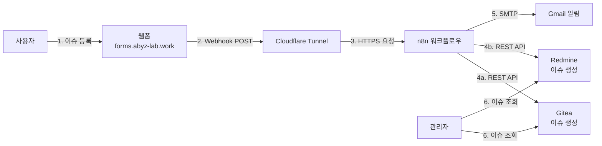

# 외부 이슈 등록 시스템 PRD

> **문서 버전:** 1.1.0
> **최종 업데이트:** 2026-01-27
> **상태:** 보완 완료 (현재 상태 반영)

---

## 📋 개요 (Overview)

### 배경
사내에서 Gitea, Redmine을 사용해 개발 이슈와 업무를 관리하고 있으나, 외부/비개발 인력이 쉽게 이슈를 등록할 수 있는 통합 창구가 부족하여 메신저, 이메일, 구두 요청 등으로 이슈가 흩어져 누락·중복이 발생하는 문제를 해결하기 위함.

### 목표
- 웹 브라우저에서 접근 가능한 단일 이슈 등록 페이지 제공
- 등록된 이슈를 n8n을 통해 Gitea/Redmine에 자동 생성
- 관리자가 이슈 현황·진행상태를 한 곳에서 확인할 수 있는 최소한의 대시보드 확보

### 성공 지표
- 수동 이슈 등록(카톡, 메일 등) 비율 80% 이상 감소
- 이슈 등록 후 Gitea/Redmine에 반영되는 평균 시간 1분 이내
- 주요 팀에서 외부 폼 사용 비율 90% 이상

---

## 🎯 요구사항 (Requirements)

### 사용자 유형

**일반 직원 / 외부 협력사:**
- 웹폼을 통해 이슈를 등록만 하는 사용자
- 비개발자도 이해할 수 있는 필드 이름과 설명 필요
- 모바일 브라우저(스마트폰)에서도 사용 가능한 레이아웃 필요

**관리자 / 개발 리드:**
- 이슈 현황, 진행률, 담당자별 작업량 확인
- 우선순위 및 상태 조정
- Gitea/Redmine UI 또는 대시보드에서 이슈 상태 확인·업데이트

### 기능 요구사항

#### 1. 이슈 등록 웹폼 ✅ [완료: 2026-01-26]

**필수 입력 필드:**
- 프로젝트: 드롭다운 (예: `internal-tools`, `customer-portal` 등)
- 제목: 문자열
- 이슈 타입: 버그 / 기능 요청 / 일반 작업 등
- 우선순위: 낮음 / 보통 / 높음 / 치명적
- 내용: 상세 설명(멀티라인 텍스트)

**선택 입력 필드:**
- 요청자 정보: 이름/이메일
- 첨부파일 링크 또는 스크린샷 URL
- 추가 메타데이터(필요 시): 브라우저/OS, 모듈명, 버전 등

**동작:**
- ✅ 사용자가 폼을 작성하고 "등록" 버튼 누르면 n8n Webhook 엔드포인트로 HTTP POST(JSON) 호출
- ✅ 성공 시 "이슈 등록 완료" 메시지 표시
- ✅ 이메일 알림: hnabyz2023@gmail.com → drake.lee@abyzr.com 자동 전달
- 실패 시 "등록 중 오류가 발생했습니다. 잠시 후 다시 시도해주세요." 메시지 표시

#### 2. n8n 워크플로우 (진행 중)

**트리거:**
- ✅ Webhook 노드 구성 완료
- HTTP 메서드: POST
- 요청 본문 형식: JSON
- 외부 폼에서 전송되는 필드 수신

**처리 로직:**
- ⏳ 입력값 검증 (필수 필드 누락 여부, 문자열 길이 제한, 허용되지 않은 값 체크)
- ⏳ 라우팅: 프로젝트/이슈 타입 등에 따라 Gitea 또는 Redmine 결정
- ⏳ 이슈 생성:
  - **Gitea:** REST API(이슈 생성 엔드포인트) 호출
    - 제목, 내용, 라벨(이슈 타입/우선순위), 담당자 매핑
  - **Redmine:** REST API(`/issues.json`) 또는 n8n Redmine 노드 사용
    - 프로젝트 ID, 트래커(버그/기능 등), 우선순위, 설명, 요청자 정보 매핑
- ✅ 알림: 이슈 생성 후 Gmail SMTP를 통해 요약 정보 전송 [완료: 2026-01-26]

**에러 처리:**
- ⏳ Gitea/Redmine API 호출 실패 시 재시도 로직
- ⏳ 실패 시 관리자에게 알림
- ⏳ 로그: 원본 요청 데이터(민감정보 제외)와 오류 메시지 저장

#### 3. 관리자용 대시보드 (1단계)

**최소 요구사항:**
- ✅ Gitea 또는 Redmine의 기본 UI·필터·검색 기능 활용 [완료: 기존 설치]
  - 상태별 이슈 목록: 열림 / 진행중 / 완료 / 보류 등
  - 프로젝트별 이슈 목록 및 수량
  - 담당자별 할당 이슈 목록

**향후 확장 (선택):**
- ⏳ n8n에서 주기적으로 Gitea/Redmine의 이슈 데이터 수집
  - 상태별 이슈 개수, 평균 해결 시간, 신규/종료 이슈 추이 집계
  - DB 또는 스프레드시트에 저장
- ⏳ 시각화: Grafana/Metabase/시트 차트 등 활용

---

## 🏗️ 아키텍처 (Architecture)

### 시스템 구성도

### 통합 개발 워크플로우 연계

이 시스템은 [ARCHITECTURE.md](ARCHITECTURE.md)의 "통합 개발 워크플로우" 1~2단계에 해당합니다:

1. **작업 시작 (Task Initiation)** ✅ [완료]
   - 외부 웹폼 접속: https://forms.abyz-lab.work
   - Cloudflare를 통해 n8n Webhook 호출
   - 이메일 알림: hnabyz2023@gmail.com → drake.lee@abyzr.com 자동 전달

2. **작업 등록 (Task Registration)** ⏳ [계획]
   - n8n이 Redmine API를 호출하여 이슈 자동 생성
   - Redmine 이슈 번호를 작업 ID로 사용
   - n8n이 Gitea API를 통해 브랜치 생성 및 PR 연결

---

## 🔧 구현 계획 (Implementation Plan)

### Phase 1: 인프라 구축 ✅ [완료: 2026-01-26]

- ✅ Raspberry Pi 5에 n8n Docker 컨테이너 배포
- ✅ Cloudflare Tunnel 구축 (forms.abyz-lab.work)
- ✅ Synology NAS (Gitea + Redmine) 구축
- ✅ 외부 HTTPS 접속 가능 (https://forms.abyz-lab.work)
- ✅ 웹폼 배포 완료 (이슈 제출 폼)
- ✅ Gmail SMTP 통합 완료 (이메일 알림)

### Phase 2: API 연동 ⏳ [계획: 2026-01-27 ~]

- ⏳ n8n → Gitea API 연동
  - 이슈 생성 엔드포인트 구현
  - 라벨, 담당자 매핑
  - 에러 핸들링 및 재시도 로직

- ⏳ n8n → Redmine API 연동
  - REST API(`/issues.json`) 호출
  - 프로젝트 ID, 트래커, 우선순위 매핑
  - 요청자 정보 처리

- ⏳ 입력값 검증 강화
  - 필수 필드 누락 체크
  - 문자열 길이 제한
  - 허용되지 않은 값 필터링

### Phase 3: 라우팅 및 워크플로우 최적화 ⏳ [계획: 2026-01-29 ~]

- ⏳ 프로젝트/이슈 타입별 라우팅 로직
  - Gitea vs Redmine 자동 선택
  - Switch/IF 노드 활용

- ⏳ n8n 워크플로우 버전 관리
  - Git 저장소와 연동하여 JSON export 버전 관리
  - 변경 시 내역 기록 및 백업

- ⏳ 설정 외부화
  - 프로젝트 목록, 이슈 타입, 우선순위 등을 n8n 변수로 관리
  - 코드 수정 없이 값 추가/변경 가능

### Phase 4: 대시보드 및 모니터링 ⏳ [계획: 2026-02-01 ~]

- ⏳ 주기적 이슈 데이터 수집
  - n8n Schedule Trigger 활용
  - 상태별 이슈 개수, 평균 해결 시간, 신규/종료 이슈 추이 집계

- ⏳ 시각화 (선택)
  - Grafana/Metabase/시트 차트 등 활용
  - 오픈 이슈 수 추이
  - 프로젝트별/담당자별 작업량
  - SLA(3일 이상 미처리 이슈 수) 모니터링

---

## ✅ 검증 (Validation)

### 기술 요구사항

**인프라:**
- ✅ Gitea, Redmine: 내부 네트워크(Tailscale) 상에 구축 완료
- ✅ n8n: 내부 환경에 Docker 컨테이너로 설치 완료
- ✅ 웹폼 호스팅: 정적 사이트(HTML/JS)로 구성, Cloudflare Tunnel을 통한 외부 접근

**보안:**
- ✅ 통신: 웹폼 → n8n Webhook 구간 HTTPS 사용
- ⏳ 인증: Webhook 엔드포인트에 시크릿 토큰, Basic Auth 적용 [계획]
- ⏳ 자격 증명: Gitea/Redmine API 토큰을 환경변수/시크릿 스토리지에 보관 [계획]

**성능·규모:**
- 예상 트래픽: 1일 수십~수백 건 수준의 이슈 등록
- 응답 시간: 이슈 등록 후 실제 Gitea/Redmine에 생성되기까지 수 초 이내
- 모니터링: n8n 워크플로우 실행 성공/실패 카운트, 오류 로그 확인

### 비기능 요구사항

**사용성:**
- ✅ 비개발자도 이해할 수 있는 필드 이름과 설명 사용
- ✅ 필요 이상 복잡한 필드 숨기기, 필수 정보 위주 설계
- ✅ 모바일 브라우저(스마트폰)에서도 사용 가능한 레이아웃과 입력 UX

**유지보수성:**
- ⏳ 프로젝트 목록, 이슈 타입, 우선순위 등을 n8n 변수로 관리 [계획]
- ⏳ n8n 워크플로우 버전 관리: Git 저장소와 연동 [계획]

### EARS 형식 요구사항 (선택사항)

#### Ubiquitous (보편적 요구사항)

- 시스템은 항상 HTTPS를 통한 보안 통신을 제공해야 한다
- 시스템은 항상 모든 이슈 등록 요청을 로깅해야 한다
- 시스템은 항상 Gitea와 Redmine에 대한 API 연결 상태를 모니터링해야 한다
- 시스템은 항상 사용자 입력 데이터를 검증해야 한다

#### Event-driven (이벤트 기반 요구사항)

- 웹폼 제출 이벤트가 발생하면 시스템은 n8n Webhook을 통해 데이터를 수신해야 한다
- 이슈 생성 API 호출이 발생하면 시스템은 Gitea 또는 Redmine에 이슈를 등록해야 한다
- 이슈 등록이 완료되면 시스템은 요청자에게 이메일 알림을 발송해야 한다
- API 호출 실패 이벤트가 발생하면 시스템은 최대 3회 재시도해야 한다
- 3회 재시도 모두 실패하면 시스템은 관리자에게 에러 알림을 발송해야 한다

#### State-driven (상태 기반 요구사항)

- Gitea API가 unavailable 상태이면 시스템은 Redmine에만 이슈를 등록해야 한다
- Redmine API가 unavailable 상태이면 시스템은 Gitea에만 이슈를 등록해야 한다
- 두 API 모두 unavailable 상태이면 시스템은 이슈를 큐에 저장하고 나중에 재시도해야 한다
- 필수 필드가 누락된 상태이면 시스템은 사용자에게 구체적인 에러 메시지를 표시해야 한다

#### Unwanted (금지 사항)

- 시스템은 사용자의 민감 정보(비밀번호, API 키)를 로그에 저장해서는 안 된다
- 시스템은 인증되지 않은 요청을 처리해서는 안 된다
- 시스템은 중복된 이슈를 자동으로 생성해서는 안 된다
- 시스템은 API 토큰을 코드에 하드코딩해서는 안 된다

#### Optional (선택적 요구사항)

- 시스템은 이슈 유형에 따라 자동으로 담당자를 할당할 수 있어야 한다
- 시스템은 첨부파일 링크를 통해 이미지를 표시할 수 있어야 한다
- 시스템은 모바일 브라우저에서 반응형 UI를 제공할 수 있어야 한다
- 시스템은 이슈 등록 후 바로가기 URL을 제공할 수 있어야 한다

---

## 📚 참조 (References)

### 관련 문서

- **[ARCHITECTURE.md](ARCHITECTURE.md)** - 시스템 아키텍처 및 통합 개발 워크플로우
- **[README.md](README.md)** - 프로젝트 개요 및 개발 로드맵
- **[DEPLOYMENT_GUIDE.md](DEPLOYMENT_GUIDE.md)** - 배포, 네트워크, 구축 가이드
- **[DEVOPS_INTEGRATION.md](DEVOPS_INTEGRATION.md)** - Gitea/Redmine API 연동 가이드

### 외부 참조

- **n8n Documentation:** https://docs.n8n.io/
- **Gitea API Documentation:** https://docs.gitea.com/en/next/developers/overview
- **Redmine REST API:** https://www.redmine.org/projects/redmine/wiki/Rest_api
- **Cloudflare Tunnel Documentation:** https://developers.cloudflare.com/cloudflare-one/connections/connect-apps/

---

## 📝 변경 이력 (Changelog)

### v1.1.0 (2026-01-27)
- 문서 구조 재편: 개요, 요구사항, 아키텍처, 구현 계획, 검증 섹션 추가
- 현재 완료된 상태 반영 (Forms 시스템, 이메일 알림)
- ARCHITECTURE.md의 "통합 개발 워크플로우"와 연계
- Mermaid 다이어그램 추가
- 진행 상태 표시 (✅ 완료, ⏳ 계획)

### v1.0.0 (초기 버전)
- 기본 PRD 문서 작성 (산문 형식)
