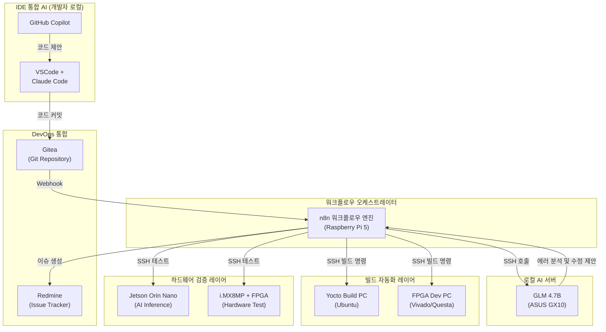
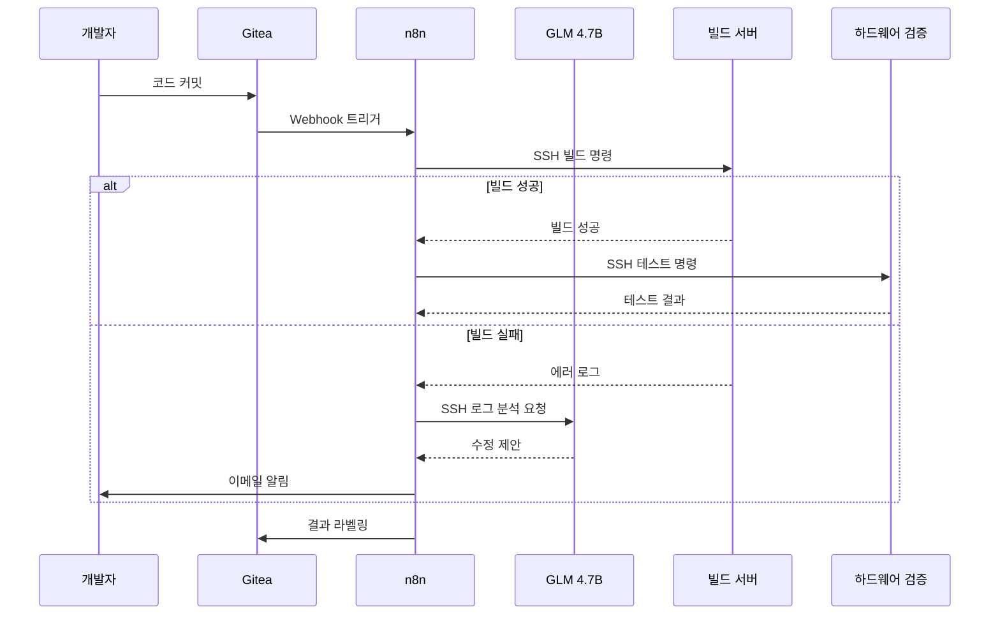

# MCP 하드웨어 개발 워크플로우 자동화 시스템 PRD

> **문서 버전:** 2.0.0
> **최종 업데이트:** 2026-01-27
> **상태:** 재구성 완료 (시스템 요건/아키텍처 문서)

---

## 📋 개요 (Overview)

### 배경
MCP-Agent-Server 프로젝트의 Phase 4 "개발 자동화 및 고도화" 단계에서 하드웨어 개발 워크플로우(C/C++, Python, FPGA)를 자동화하고, n8n 워크플로우 엔진을 통해 로컬 LLM과 연동하여 반복 작업을 최소화하기 위함.

### 목표
- 다양한 언어(C/C++, C#, Python) 및 FPGA 개발 환경 통합
- n8n을 통한 빌드 자동화 및 테스트 파이프라인 구축
- 로컬 LLM(GLM 4.7B)을 활용한 코드 분석 및 에러 해결 자동화
- 하드웨어 검증 레이어(Jetson, i.MX8MP+FPGA)와의 SSH 통합

### 성공 지표
- 수동 빌드/테스트 시간 90% 이상 감소
- 에러 발생 시 자동 분석 및 수정 제안률 70% 이상
- 일일 빌드/테스트 자동 실행률 100%

---

## 🎯 시스템 요건 (System Requirements)

### 하드웨어 요구사항

#### 1. 기본 서버 / 워크스테이션 ⏳ [계획]

**권장 사양:**
- **CPU:** AMD Ryzen 9 7950X / Intel Core i9-14900K
- **RAM:** DDR5 64GB 이상 (FPGA 병렬 시뮬레이션 시 128GB 권장)
- **저장장치:** NVMe SSD 2TB (OS용) / SATA SSD 4TB (빌드 캐시) / HDD 8TB
- **GPU:** NVIDIA RTX 4080 이상 (CUDA 12.2+)
- **네트워크:** 10GbE LAN 포트 이상 권장

#### 2. 로컬 LLM 서버 (ASUS GX10) ⏳ [계획]

**구성:**
- **CPU:** AMD Ryzen 9 7950X3D
- **RAM:** DDR5 128GB
- **GPU:** NVIDIA RTX 4090 24GB
- **SSD:** NVMe 4TB (모델 저장용)
- **모델:** GLM 4.7B (로컬 LLM)

**용도:**
- n8n 워크플로우에서 SSH 호출
- 에러 로그 분석
- 코드 수정 제안
- 반복 작업 자동화

#### 3. FPGA 전용 머신 (옵션) ⏳ [계획]

**구성:**
- **보드:** Xilinx Alveo U250 또는 Intel Stratix 10 GX
- **슬롯:** PCIe 4.0 x16
- **전원:** 800W 이상 PSU

#### 4. 하드웨어 검증 레이어 ⏳ [계획]

**Jetson Orin Nano:**
- AI 모델 추론 성능 테스트
- SSH 원격 실행
- 전력 소비 측정

**i.MX8MP + FPGA:**
- 하드웨어 구현 검증
- SSH 원격 실행
- 시뮬레이션 결과 비교

### 소프트웨어 요구사항

#### 1. OS 및 가상화 환경 ⏳ [계획]

**WSL2 (Windows 11 Pro):**
```powershell
# WSL2 활성화
dism.exe /online /enable-feature /featurename:Microsoft-Windows-Subsystem-Linux /all /norestart
dism.exe /online /enable-feature /featurename:VirtualMachinePlatform /all /norestart
wsl --set-default-version 2

# Ubuntu 22.04 LTS 설치
wsl --install -d Ubuntu-22.04
```

**기본 패키지:**
```bash
sudo apt update
sudo apt install -y build-essential cmake python3-pip libboost-all-dev git
```

#### 2. 개발 도구 ⏳ [계획]

**C++ (GCC 12):**
```bash
sudo apt install -y gcc-12 g++-12
sudo update-alternatives --install /usr/bin/gcc gcc /usr/bin/gcc-12 100
sudo update-alternatives --install /usr/bin/g++ g++ /usr/bin/g++-12 100
```

**C# (.NET SDK 8):**
```powershell
winget install Microsoft.DotNet.SDK.8
```

**Python (pyenv + poetry):**
```bash
curl https://pyenv.run | bash
pyenv install 3.11.5
pyenv global 3.11.5
pip install --upgrade pip
pip install poetry
```

**FPGA 툴 (Vivado):**
```bash
./xsetup --agree XilinxEULA,3rdPartyEULA --batch Install
```

#### 3. 빌드 자동화 ⏳ [계획]

**Jenkins 파이프라인:**
```groovy
pipeline {
  agent any
  stages {
    stage('Build C++') {
      steps {
        sh 'cmake -B build -S .'
        sh 'cmake --build build'
      }
    }
    stage('Run Unit Tests') {
      steps {
        sh './build/runTests'
      }
    }
    stage('FPGA Synthesis') {
      steps {
        sh 'vivado -mode batch -source synthesis.tcl'
      }
    }
  }
}
```

**GitHub Actions CI:**
```yaml
name: MCP CI
on:
  push:
    branches: [ main ]
  pull_request:
    branches: [ main ]

jobs:
  build:
    runs-on: ubuntu-latest
    steps:
      - uses: actions/checkout@v4
      - name: Install dependencies
        run: |
          sudo apt-get update
          sudo apt-get install -y build-essential cmake
      - name: Configure and Build
        run: |
          cmake -S . -B build
          cmake --build build -j 4
      - name: Run C++ tests
        run: ctest --test-dir build
```

### EARS 형식 요구사항 (선택사항)

#### Ubiquitous (보편적 요구사항)

- 시스템은 항상 모든 빌드 및 테스트 결과를 기록해야 한다
- 시스템은 항상 Tailscale VPN을 통한 보안 SSH 연결을 제공해야 한다
- 시스템은 항상 Gitea Webhook을 통해 코드 변경 사항을 감지해야 한다
- 시스템은 항상 빌드/테스트 실패 시 상세한 로그를 저장해야 한다

#### Event-driven (이벤트 기반 요구사항)

- Gitea에 코드 커밋 이벤트가 발생하면 시스템은 자동으로 빌드를 트리거해야 한다
- 빌드 성공 이벤트가 발생하면 시스템은 자동으로 테스트를 실행해야 한다
- 빌드 실패 이벤트가 발생하면 시스템은 GLM 4.7B를 통해 에러 로그를 분석해야 한다
- 테스트 완료 이벤트가 발생하면 시스템은 결과를 Gitea 상태로 업데이트해야 한다
- 에러 분석 완료 이벤트가 발생하면 시스템은 수정 제안을 개발자에게 이메일로 발송해야 한다

#### State-driven (상태 기반 요구사항)

- 빌드 서버가 busy 상태이면 시스템은 요청을 큐에 대기시켜야 한다
- 하드웨어 검증 장비가 unavailable 상태이면 시스템은 건너뛰고 나중에 재시도해야 한다
- 빌드가 실패 상태이면 시스템은 테스트를 실행하지 않고 에러 분석으로 넘어가야 한다
- 에러가 수정된 상태이면 시스템은 자동으로 빌드를 재시작해야 한다

#### Unwanted (금지 사항)

- 시스템은 수동 개입 없이 실패한 빌드를 다시 시도해서는 안 된다 (최대 3회)
- 시스템은 하드웨어 장비에 직접 물리적 접근을 시도해서는 안 된다
- 시스템은 API 토큰이나 SSH 키를 로그에 기록해서는 안 된다
- 시스템은 빌드 실패 원인을 분석하지 않고 알림만 발송해서는 안 된다

#### Optional (선택적 요구사항)

- 시스템은 빌드 캐시를 활용하여 빌드 시간을 단축할 수 있어야 한다
- 시스템은 여러 CPU 아키텍처(x86_64, ARM64)에서 병렬 빌드를 실행할 수 있어야 한다
- 시스템은 빌드/테스트 결과를 Slack 또는 Teams에 알림으로 전송할 수 있어야 한다
- 시스템은 하드웨어 장비의 전력 소비량을 모니터링할 수 있어야 한다

---

## 🏗️ 아키텍처 (Architecture)

### 시스템 구성도



### 통합 개발 워크플로우 연계

이 시스템은 [ARCHITECTURE.md](ARCHITECTURE.md)의 "통합 개발 워크플로우" 4~5단계에 해당합니다:

**4. 코드 검증 (Code Verification)** ⏳ [계획]
- Jetson Orin Nano: AI 모델 추론 성능 테스트 (SSH 원격 실행)
- i.MX8MP + FPGA: 하드웨어 구현 검증 (SSH 원격 실행)

**5. 빌드 자동화 (Build Automation)** ⏳ [계획]
- Yocto PC: n8n이 SSH로 Yocto 빌드 스크립트 실행
- FPGA Dev PC: n8n이 SSH로 Vivado 합성/Questa 시뮬레이션 실행

### 개발 파이프라인



---

## 🔧 구현 계획 (Implementation Plan)

### Phase 1: 인프라 구축 ⏳ [계획: 2026-02-01 ~]

- ⏳ ASUS GX10 로컬 LLM 서버 구축
  - Ubuntu 22.04 LTS 설치
  - GLM 4.7B 모델 배포
  - SSH 서버 설정 (Tailscale VPN)

- ⏳ 빌드 서버 구축
  - Yocto Build PC: Ubuntu + Yocto SDK
  - FPGA Dev PC: Ubuntu + Vivado + Questa
  - SSH 서버 설정 (Tailscale VPN)

- ⏳ 하드웨어 검증 레이어 구축
  - Jetson Orin Nano: JetPack SDK 설치
  - i.MX8MP + FPGA: Yocto 빌드 환경 구성
  - SSH 서버 설정 (Tailscale VPN)

### Phase 2: n8n 워크플로우 개발 ⏳ [계획: 2026-02-05 ~]

- ⏳ 빌드 자동화 워크플로우
  - Gitea Webhook 트리거
  - SSH 노드를 통한 원격 빌드 명령
  - 빌드 결과 수집 및 로그 저장

- ⏳ 테스트 자동화 워크플로우
  - SSH 노드를 통한 원격 테스트 실행
  - 테스트 결과 수집 및 보고

- ⏳ 에러 처리 워크플로우
  - 빌드/테스트 실패 감지
  - GLM 4.7B를 통한 에러 로그 분석
  - 수정 제안 생성 및 이메일 알림

### Phase 3: 로컬 LLM 연동 ⏳ [계획: 2026-02-10 ~]

- ⏳ GLM 4.7B API 서버 구축
  - FastAPI 기반 API 엔드포인트
  - 에러 로그 분석 기능
  - 코드 수정 제안 기능

- ⏳ n8n과 GLM 4.7B 연동
  - SSH를 통한 GLM 4.7B API 호출
  - 에러 로그 전송 및 수정 제안 수신
  - 결과를 Gitea 커밋 또는 이슈에 반영

### Phase 4: 고도화 및 최적화 ⏳ [계획: 2026-02-15 ~]

- ⏳ 자동 작업 분해
  - 복잡한 개발 요청을 하위 작업으로 자동 분해
  - 각 단계마다 적절한 도구 자동 할당

- ⏳ 피드백 루프
  - 테스트 실패 시 자동으로 에이전트에게 피드백
  - 최대 재시도 횟수 설정 및 실패 시 사용자 알림

- ⏳ 성능 모니터링
  - CPU/GPU/메모리/디스크 사용량 모니터링
  - 빌드 시간, 테스트 시간 추적

---

## ✅ 검증 (Validation)

### 테스트 전략

#### 1. 유닛 테스트 ⏳ [계획]

**C++ (Google Test):**
```cmake
enable_testing()
find_package(GTest REQUIRED)

add_executable(runTests
    tests/test_main.cpp
    tests/test_sample.cpp
)

target_link_libraries(runTests PRIVATE GTest::GTest GTest::Main)
add_test(NAME AllTests COMMAND runTests)
```

**Python (pytest):**
```toml
[tool.pytest.ini_options]
minversion = "7.0"
addopts = "-v --cov=src"
testpaths = ["tests"]
```

**FPGA 시뮬레이션:**
```tcl
vlib work
vlog -sv design.sv testbench.sv
vsim -c testbench
run -all
quit -sim
```

#### 2. 통합 테스트 ⏳ [계획]

**통합 테스트 스크립트:**
```bash
#!/usr/bin/env bash
set -e

echo "C++ 단위 테스트"
ctest --test-dir build

echo "Python 테스트"
pytest

echo "FPGA 시뮬레이션"
vsim -c -do simulate.tcl

echo "모든 테스트 통과"
```

#### 3. 성능 테스트 ⏳ [계획]

- 빌드 시간 측정
- 테스트 실행 시간 측정
- 리소스 사용량 모니터링 (htop, nvidia-smi)

### 문서화 자동화 ⏳ [계획]

#### 1. Doxygen (C/C++)

```conf
EXTRACT_ALL = YES
INPUT = src/
OUTPUT_DIRECTORY = docs/
GENERATE_LATEX = NO
GENERATE_HTML = YES
```

#### 2. MkDocs (다중 언어)

```yaml
site_name: MCP Documentation
theme:
  name: material

nav:
  - Home: index.md
  - Build:
      - Overview: build/overview.md
  - API Reference:
      - C++: api/cpp.md
      - C#: api/csharp.md
      - Python: api/python.md
      - FPGA: api/fpga.md
```

---

## 📊 구축 완료 체크리스트

### 인프라
- ⏳ C++/C#/Python 빌드 및 테스트가 CI에서 자동 수행되는지
- ⏳ FPGA 합성 및 시뮬레이션 스크립트가 비대화식으로 동작하는지
- ⏳ Doxygen + MkDocs 기반 문서가 자동 생성 및 배포되는지
- ⏳ MCP 관련 Python 서비스가 지정 포트에서 정상 동작하는지
- ⏳ CPU/GPU/메모리/디스크 사용량이 안정적인지

### 기능
- ⏳ n8n 워크플로우가 Gitea Webhook을 통해 트리거되는지
- ⏳ SSH를 통한 원격 빌드/테스트가 정상 실행되는지
- ⏳ GLM 4.7B가 에러 로그를 분석하고 수정 제안을 생성하는지
- ⏳ 빌드/테스트 실패 시 자동으로 이메일 알림이 발송되는지
- ⏳ 결과가 Gitea와 Redmine에 자동 반영되는지

---

## 📚 참조 (References)

### 관련 문서

- **[ARCHITECTURE.md](ARCHITECTURE.md)** - 시스템 아키텍처 및 통합 개발 워크플로우
  - "하드웨어 검증 레이어" 섹션 참조
  - "빌드 자동화 레이어" 섹션 참조
  - "통합 개발 워크플로우" 4~5단계 참조

- **[README.md](README.md)** - 프로젝트 개요 및 개발 로드맵
  - Phase 4: 개발 자동화 및 고도화

- **[DEPLOYMENT_GUIDE.md](DEPLOYMENT_GUIDE.md)** - 배포, 네트워크, 구축 가이드
  - Tailscale VPN 네트워크 구성

### 외부 참조

**하드웨어:**
- **NVIDIA Jetson Documentation:** https://developer.nvidia.com/embedded/learn/get-started-jetson
- **i.MX8MP Reference Manual:** https://www.nxp.com/docs/en/reference-manual/IMX8MPRM.pdf
- **Xilinx Vivado Design Suite:** https://www.xilinx.com/support/download.html

**빌드 도구:**
- **CMake Documentation:** https://cmake.org/documentation/
- **Jenkins Pipeline:** https://www.jenkins.io/doc/book/pipeline/
- **GitHub Actions:** https://docs.github.com/en/actions

**로컬 LLM:**
- **GLM 4.7B:** https://github.com/THUDM/GLM-4
- **FastAPI:** https://fastapi.tiangolo.com/

---

## 📝 변경 이력 (Changelog)

### v2.0.0 (2026-01-27)
- 문서 전면 재구성: 절차서 → 시스템 요건/아키텍처 문서
- ARCHITECTURE.md의 "하드웨어 검증 레이어", "빌드 자동화 레이어" 통합
- 프로젝트 Phase 4와 연계
- Mermaid 다이어그램 추가 (시스템 구성도, 개발 파이프라인)
- 통합 개발 워크플로우 연계 명시
- 진행 상태 표시 (⏳ 계획)

### v1.0.0 (초기 버전)
- MCP 서버 구축 절차서 작성 (step-by-step 형식)
